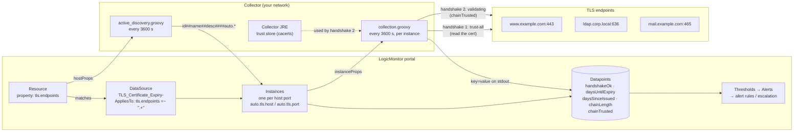
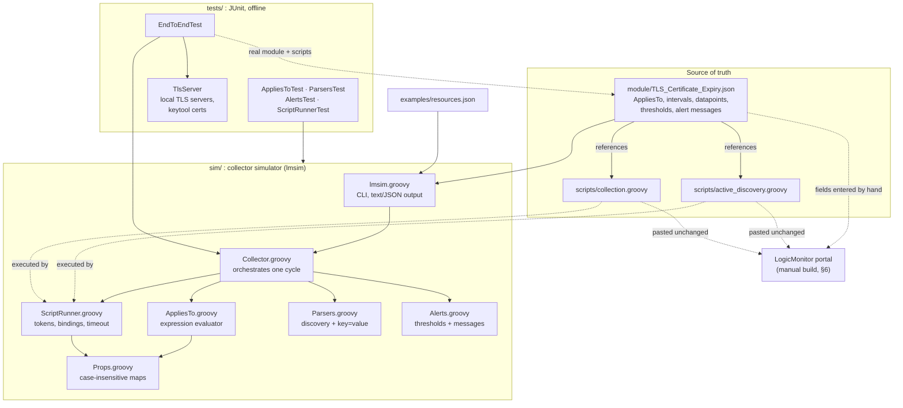
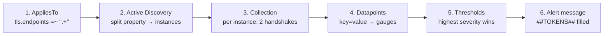
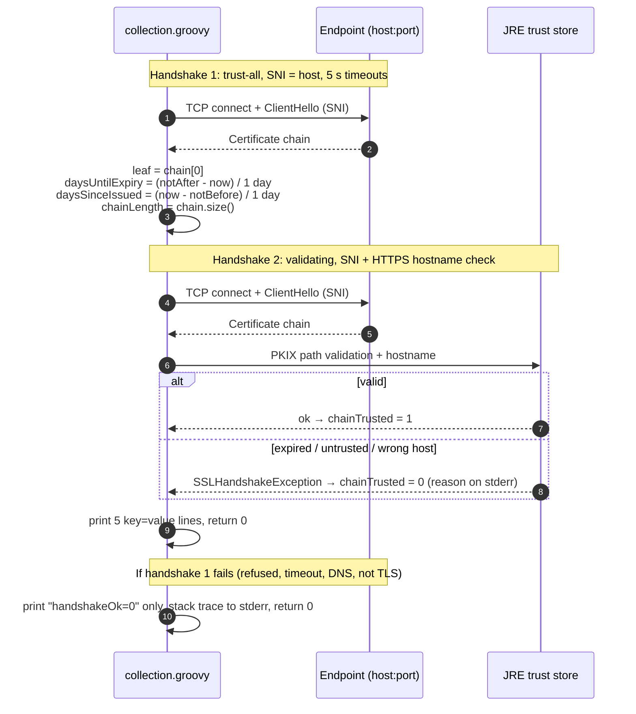

# TLS Certificate Expiry — User & Developer Guide

This guide explains how the `TLS_Certificate_Expiry-` LogicMonitor DataSource
is put together, how data flows from a resource property to an alert, and how
to run, test, deploy and operate it.

The [README](../README.md) is the design record: it covers *why* each decision
was made (gauges, exit codes, trust-all handshakes, threshold choices). This
guide covers *how* the pieces fit and *what to type*.

---

## Contents

1. [Quick start](#1-quick-start)
2. [Architecture](#2-architecture)
3. [How it works, end to end](#3-how-it-works-end-to-end)
4. [What you will see: outcome matrix](#4-what-you-will-see-outcome-matrix)
5. [Local development](#5-local-development)
6. [Deploying to a LogicMonitor portal](#6-deploying-to-a-logicmonitor-portal)
7. [Operating the module](#7-operating-the-module)
8. [Troubleshooting](#8-troubleshooting)
9. [Reference](#9-reference)

---

## 1. Quick start

### Prerequisites

| Tool | Why | Verified with |
|---|---|---|
| JDK (with `keytool`) | Runs Groovy; tests generate certificates with `keytool` | OpenJDK 25; JDK 8 |
| Groovy (`groovy`, `groovyc` on `PATH`) | Scripts, simulator and tests | Groovy 6.0 (on JDK 25); Groovy 2.4.21 (on JDK 8) |
| Network access | Only for `./lmsim` against the sample live endpoints; tests are offline | — |
| `jq` (optional) | Slicing `./lmsim --json` output | — |

### Five commands

```bash
cd lm-tls-cert-expiry

# 1. Run the offline test suite (20 tests, ~5 s)
./run-tests.sh

# 2. Simulate a full collector cycle against the sample resources
./lmsim

# 3. Check one endpoint the same way the collector would
groovy scripts/collection.groovy expired.badssl.com:443

# 4. See what instances a property value produces
groovy scripts/active_discovery.groovy "www.example.com, ldap.corp.local:636"

# 5. Machine-readable results for one resource
./lmsim --resource collector01 --json | jq '.resources[].instances[] | {name, alerts: [.alerts[].subject]}'
```

### Monitor your own endpoints (locally)

Create a resources file and point the simulator at it:

```bash
cat > /tmp/my-resources.json <<'EOF'
{
  "resources": [
    {
      "displayName": "prod-collector",
      "hostname": "prod-collector.corp.local",
      "properties": {
        "tls.endpoints": "intranet.corp.local, ldap.corp.local:636, smtp.corp.local:465"
      }
    }
  ]
}
EOF

./lmsim --resources /tmp/my-resources.json
```

### Monitor your own endpoints (in LogicMonitor)

Once the DataSource exists in your portal (see [§6](#6-deploying-to-a-logicmonitor-portal)),
monitoring is one property on any resource:

```
tls.endpoints = www.example.com:443,ldap.corp.local:636,mail.example.com:465
```

Instances appear at the next Active Discovery run. Clearing the property removes them.

---

## 2. Architecture

### 2.1 Runtime architecture (in a LogicMonitor portal)



Key points:

- **The resource is only a carrier.** The property can sit on any resource;
  that resource's collector makes the checks. The resource does not need to be
  one of the endpoints.
- **Discovery and collection are separate scripts** that talk only through
  the discovery output line and the `auto.tls.*` instance properties.
- **All traffic is collector → endpoint**, direct TCP (no proxy), two TLS
  handshakes per endpoint per hour.

### 2.2 Repository architecture (development and testing)



The two scripts are **the same files** in every context. On a collector they
read `hostProps` / `instanceProps`; run by hand they fall back to a command-line
argument; run by `lmsim` they get simulated `hostProps` / `instanceProps`. The
tested code is the code that ships.

### 2.3 Component responsibilities

| Component | Responsibility | Key behaviour |
|---|---|---|
| `module/TLS_Certificate_Expiry.json` | Declares the DataSource | Not LogicMonitor's export format; a readable spec used by `lmsim` and for building the module by hand |
| `scripts/active_discovery.groovy` | `tls.endpoints` → instance lines | Trims, defaults port 443, de-duplicates, rejects invalid entries on stderr, always exits 0 |
| `scripts/collection.groovy` | One endpoint → five datapoints | Trust-all handshake to read the cert, validating handshake for trust, always exits 0 |
| `sim/Collector.groovy` | One simulated cycle per resource | AppliesTo → discovery → per-instance collection → thresholds → alerts |
| `sim/AppliesTo.groovy` | Evaluates AppliesTo expressions | `\|\| && ! () == != =~ !~ exists() hasCategory()`, case-insensitive; rejects anything it does not understand |
| `sim/ScriptRunner.groovy` | Runs a script the way the collector does | `##TOKEN##` substitution, no `args`, stdout/stderr capture, return value as exit code, hard timeout |
| `sim/Parsers.groovy` | Parses script output | Discovery line format, forbidden wildvalue chars (`= : \ #` space), `key=value` → number or `NaN` |
| `sim/Alerts.groovy` | Thresholds and messages | Highest severity wins, `NaN` never alerts, flags unknown `##TOKENS##` |
| `sim/Props.groovy` | Property maps | Case-insensitive, like the collector's |
| `tests/*` | Regression suite | Offline: local TLS servers with generated valid / expired certs |
| `lmsim`, `run-tests.sh` | Entry points | Compile on demand into `build/` (git-ignored) |

---

## 3. How it works, end to end

The same pipeline runs in the portal and in `lmsim`:



### Stage 1: AppliesTo

```
tls.endpoints =~ ".+"
```

The DataSource applies to any resource where `tls.endpoints` is set and
non-empty. A missing or empty property means no match, so no discovery and
no instances.

### Stage 2: Active Discovery

Input: `hostProps.get("tls.endpoints")`

```
www.example.com, ldap.corp.local:636, www.example.com:443, ::1
```

Output (stdout), one line per instance:

```
www.example.com_443##www.example.com:443##TLS endpoint www.example.com on port 443####auto.tls.host=www.example.com&auto.tls.port=443
ldap.corp.local_636##ldap.corp.local:636##TLS endpoint ldap.corp.local on port 636####auto.tls.host=ldap.corp.local&auto.tls.port=636
```

stderr: `Skipping invalid endpoint '::1': expected host[:port]`

| Rule | Example |
|---|---|
| Port defaults to 443 | `www.example.com` → `www.example.com_443` |
| Duplicates collapse | `a.com` and `a.com:443` are one instance |
| Whitespace ignored | `" a.com , b.com "` works |
| Invalid entries skipped (stderr) | IPv6 literals, spaces, ports outside 1–65535, non-numeric ports |
| Empty property → no output, exit 0 | Removes previously discovered instances |

The wildvalue is `host_port`, not `host:port`, because LogicMonitor returns
NoData for wildvalues containing `:`. The display name keeps `host:port`.

### Stage 3: Collection

Collection runs once per instance and reads `auto.tls.host` and
`auto.tls.port` from `instanceProps`.



Successful output:

```
handshakeOk=1
daysUntilExpiry=44
daysSinceIssued=45
chainLength=3
chainTrusted=1
```

Failed output: `handshakeOk=0`, and nothing else.

### Stage 4: Datapoints

Each datapoint is a **gauge** that uses the Key-Value post-processor with the
same key. A key missing from stdout becomes `NaN` for that poll, which is how
the other four datapoints go blank during an outage.

### Stage 5: Thresholds

| Datapoint | Threshold | Warning | Error | Critical |
|---|---|---|---|---|
| `handshakeOk` | `!= 1` | — | — | `0` |
| `daysUntilExpiry` | `< 30 14 7` | `< 30` | `< 14` | `< 7` |
| `chainTrusted` | `!= 1` | — | `0` | — |
| `daysSinceIssued` | none | | | |
| `chainLength` | none | | | |

`NaN` never crosses a threshold. That is why the script always exits 0 and
reports a failure as `handshakeOk=0` instead of failing.

### Stage 6: Alert messages

`handshakeOk` and `chainTrusted` have their own messages. `daysUntilExpiry`
uses the module-level message:

```
Subject: TLS cert on expired.badssl.com:443 expires in -4187 days (collector01)
Body:    Datapoint daysUntilExpiry on expired.badssl.com:443 is -4187, crossing threshold < 7. Renew before expiry.
         Resource: collector01   Level: critical
```

Tokens used: `##HOST## ##INSTANCE## ##DSIDESCRIPTION## ##DATAPOINT## ##VALUE## ##THRESHOLD## ##LEVEL##`.

---

## 4. What you will see: outcome matrix

Example values come from a `./lmsim` run against `examples/resources.json` (live badssl.com endpoints), plus the offline test cases.

| Endpoint situation | handshakeOk | daysUntilExpiry | chainTrusted | Alerts raised |
|---|---|---|---|---|
| Healthy, > 30 days left | 1 | e.g. 44 | 1 | none |
| Healthy, 27 days left | 1 | 27 | 1 | **warning** (expiry) |
| Expired certificate | 1 | negative (−4187) | 0 | **critical** (expiry) + **error** (trust) |
| Self-signed / private CA not in trust store | 1 | e.g. 723 | 0 | **error** (trust) |
| Hostname mismatch | 1 | e.g. 27 | 0 | **error** (trust), plus expiry alert if due |
| Port closed / unreachable / not TLS / STARTTLS | 0 | NaN | NaN | **critical** (handshake) only |
| Script crashed or timed out (should not happen) | NaN | NaN | NaN | none: shows as No Data |
| Property missing or empty | — | — | — | not monitored (AppliesTo false) |

---

## 5. Local development

### 5.1 Running the scripts directly

```bash
groovy scripts/collection.groovy <host>[:port]
groovy scripts/active_discovery.groovy "<host>[:port],<host>[:port],..."
```

With no argument, each script uses a built-in default endpoint list. The
`chainTrusted=0` reason and any failure stack trace go to stderr.

Good test endpoints:

| Endpoint | Exercises |
|---|---|
| `expired.badssl.com` | negative `daysUntilExpiry`, `chainTrusted=0` |
| `self-signed.badssl.com` | `chainLength=1`, `chainTrusted=0` |
| `untrusted-root.badssl.com` | unknown CA |
| `wrong.host.badssl.com` | hostname mismatch |
| `127.0.0.1:9999` | `handshakeOk=0` (connection refused) |

### 5.2 The simulator: `lmsim`

```
./lmsim [--module FILE] [--resources FILE] [--resource NAME] [--json]
```

| Option | Default | Meaning |
|---|---|---|
| `--module` | `module/TLS_Certificate_Expiry.json` | Module definition to run |
| `--resources` | `examples/resources.json` | Resources and their properties |
| `--resource` | all | Only the resource whose `displayName` or `hostname` matches |
| `--json` | off | JSON output (`NaN` becomes `null`) |

| Exit code | Meaning |
|---|---|
| `0` | Module ran cleanly. Alerts are normal output, not failures |
| `1` | Discovery reported errors, or an alert message uses an unrecognised `##TOKEN##` |
| `2` | Bad usage or no matching resources |

Because it exits 1 on module defects, `./lmsim` can gate a commit hook or a CI job:

```bash
./run-tests.sh && ./lmsim --resource collector01 > /dev/null
```

`lmsim` compiles `sim/` into `build/classes` the first time it runs, and again
whenever a `sim/*.groovy` file changes.

Useful `jq` recipes:

```bash
# Every alert subject
./lmsim --json | jq -r '.resources[].instances[]?.alerts[].subject'

# Days left per endpoint, soonest first
./lmsim --json | jq -r '[.resources[].instances[]? |
  {name, d: (.datapoints[] | select(.name=="daysUntilExpiry").value)}] |
  sort_by(.d) | .[] | "\(.d)\t\(.name)"'

# Discovery errors/warnings
./lmsim --json | jq '.resources[].discovery? | {errors, warnings, stderr}'
```

### 5.3 Tests

```bash
./run-tests.sh
# 20 tests, 0 failures, ~4000ms
```

Each run compiles `sim/` and `tests/` into `build/test-classes` from scratch.
No network is needed: `TlsServer` starts loopback TLS servers with certificates
generated by `keytool`.

| Test class | Covers |
|---|---|
| `AppliesToTest` | Operators, precedence, case-insensitivity, `exists()`, `hasCategory()`, rejection of unsupported syntax |
| `ParsersTest` | Discovery line format, forbidden wildvalue characters, malformed lines, `auto.` prefix warning, `key=value` → `NaN` |
| `AlertsTest` | Severity selection, `NaN` never alerts, token rendering, value formatting |
| `ScriptRunnerTest` | Token substitution, exit codes, stdout/stderr capture, no `args` binding, timeout |
| `EndToEndTest` | Real module + scripts against valid / expired / closed endpoints; one alert per outage; AppliesTo on missing and empty properties; invalid endpoints; failed and timed-out collection; discovery keep/remove behaviour; regression for the original `host:port` wildvalue bug |

### 5.4 Making a change

| You want to… | Edit | Then verify |
|---|---|---|
| Change a threshold or alert text | `module/TLS_Certificate_Expiry.json` | `./lmsim` (catches unknown tokens), then update the portal |
| Add a datapoint | `scripts/collection.groovy` (print `key=value`) + a datapoint entry in the module JSON | `./run-tests.sh`, `./lmsim`, `groovy scripts/collection.groovy <host>` |
| Change endpoint parsing | `scripts/active_discovery.groovy` | `EndToEndTest.skipsEndpointsThatCannotBeInstances`, `./lmsim` |
| Extend the simulator | `sim/*.groovy` + a test in `tests/` | `./run-tests.sh` |

Rules to keep:

- Scripts must **always return 0**. Report failures as datapoint values.
- Never use `:`, `=`, `\`, `#` or spaces in a wildvalue.
- Read inputs with `binding.hasVariable(...)` guards so the script still runs standalone.
- Use only JDK classes, so the script runs on any collector OS.

---

## 6. Deploying to a LogicMonitor portal

`module/TLS_Certificate_Expiry.json` is this project's own spec, **not** an
importable LogicMonitor export. Build the DataSource by hand once:

1. **Modules → Add → DataSource**
2. General:
   - Name `TLS_Certificate_Expiry-`, Display name `TLS Certificate Expiry`, Group `Security`
   - Collect every **1 hour**, **Multi-instance** on
3. AppliesTo: `tls.endpoints =~ ".+"`
4. Active Discovery:
   - Method **Script → Embedded Groovy**, schedule every **1 hour**
   - Paste `scripts/active_discovery.groovy` **unchanged**
5. Collector attributes:
   - **Script → Embedded Groovy**
   - Paste `scripts/collection.groovy` **unchanged**
6. Datapoints: add five **Normal** datapoints of type **Gauge**, source *Key-Value pairs*:

   | Name | Key | Threshold |
   |---|---|---|
   | `handshakeOk` | `handshakeOk` | `!= 1` critical |
   | `daysUntilExpiry` | `daysUntilExpiry` | `< 30 14 7` |
   | `daysSinceIssued` | `daysSinceIssued` | — |
   | `chainLength` | `chainLength` | — |
   | `chainTrusted` | `chainTrusted` | `!= 1` error |

7. Alert messages: copy the subjects and bodies from the module JSON (the
   module-level message for `daysUntilExpiry`, the per-datapoint messages for
   `handshakeOk` and `chainTrusted`).
8. Save. Then verify:
   1. Set `tls.endpoints` on a resource.
   2. Run Active Discovery. You should see one instance per endpoint, named `host:port`.
   3. Compare an instance's **Raw Data** tab with `./lmsim` output for the same endpoint.
   4. Use **Poll Now** and **Test Script** on an instance to see live stdout.

---

## 7. Operating the module

### 7.1 Choosing where to put `tls.endpoints`

| Pattern | When |
|---|---|
| One "carrier" resource per collector with the full list | Recommended. Each endpoint is checked once, from the collector that can reach it |
| Property on the resource that *is* the endpoint (e.g. `ldap01` → `ldap01.corp.local:636`) | When you want the cert alert attached to that server |
| Property on a resource group | Avoid for long lists. Every member's collector checks every endpoint |

Always list the **DNS name clients use**, not an IP. The name is sent as SNI
and used for the hostname check, so an IP usually gives the wrong certificate
or `chainTrusted=0`.

### 7.2 Supported services

Any **implicit-TLS** port works, for example HTTPS 443, LDAPS 636, SMTPS 465,
IMAPS 993, POP3S 995, and TLS-fronted brokers and databases.

**STARTTLS** ports do not work and report `handshakeOk=0`. That includes SMTP
25/587, LDAP 389, IMAP 143 and PostgreSQL 5432.

### 7.3 Private / internal CAs

`chainTrusted` validates against the **collector's JRE trust store**. For
endpoints signed by an internal CA, import the root into that JRE's `cacerts`
on each collector that checks them:

```bash
keytool -importcert -alias corp-root-ca -file corp-root-ca.pem \
  -keystore <collector-jre>/lib/security/cacerts -storepass changeit -noprompt
```

Then restart the collector. Collector upgrades can replace the bundled JRE, so
re-check after an upgrade. Until the CA is trusted, those endpoints raise
`chainTrusted` **error** alerts. Expiry monitoring is unaffected.

### 7.4 Tuning thresholds

- **ACME-managed estates:** clients renew at about 30 days left, so
  the 30-day warning can fire briefly. Lower the warning to about **20**. A
  cert still under 20 days means automation has failed.
- **Manually renewed certs with slow procurement:** consider raising the
  warning to **45–60**.
- Override per instance or per group in the portal. You don't need to change
  the module.

### 7.5 Reading the datapoints

| Signal | Likely meaning |
|---|---|
| `daysSinceIssued` drops sharply | Certificate was reissued (expected after renewal) |
| `daysUntilExpiry` jumps up | Renewal deployed |
| `chainLength` drops to 1 on a public site | Missing intermediate certificate in the server config |
| `chainTrusted` flips 1 → 0 with expiry OK | Intermediate expired, hostname changed, or CA removed from trust store |
| Gap in the expiry graph + `handshakeOk=0` | Endpoint down. Expiry resumes on the next successful poll |

Cost: two TLS handshakes per endpoint per hour. A reachable endpoint takes
about 0.5 s per run. An unreachable one fails the first handshake within the
5 s connect timeout, and the second handshake is skipped. The worst case is an
endpoint that accepts TCP and then stalls. Both handshakes then use their full
5 s connect and 5 s read timeouts, which is about 20 s plus DNS, against the
60 s script limit. To change the timeouts, edit `timeoutMs` in
`scripts/collection.groovy`.

---

## 8. Troubleshooting

| Symptom | Cause | Fix |
|---|---|---|
| No instances appear | Property missing, empty, or set on a resource the DataSource doesn't apply to | Check the property name `tls.endpoints` and run Active Discovery manually |
| An endpoint is missing from the instances | Entry rejected as invalid | Check discovery stderr (`Skipping invalid endpoint …`). No IPv6 literals, no spaces inside an entry, port 1–65535 |
| Instance shows **No Data** for everything | Script failed or timed out (not expected), or wildvalue invalid | Use **Test Script** on the instance and read the collector log. Run `groovy scripts/collection.groovy host:port` from the collector host |
| `handshakeOk=0` but the site works in a browser | Collector can't reach it (firewall, DNS, proxy-only egress), or port is STARTTLS | From the collector: `openssl s_client -connect host:port -servername host`. There is no proxy support |
| `chainTrusted=0` on an internal endpoint | Private CA not in the collector JRE trust store | [§7.3](#73-private--internal-cas) |
| `chainTrusted=0` on a public endpoint | Expired or missing intermediate, hostname mismatch, or revoked/removed CA | stderr names the reason (`PKIX path …`, `No subject alternative DNS name …`) |
| Wrong certificate reported | IP listed instead of hostname, so SNI doesn't select the right vhost | List the hostname |
| `./lmsim` exits 1 | Discovery errors or unknown alert token | Read the `ERROR` lines in the output |
| `./lmsim` exits 2 | Bad flag, or `--resource` matched nothing | Check spelling against `displayName` / `hostname` |
| `groovyc: command not found` | Groovy not installed or not on `PATH` | Install Groovy (for example with SDKMAN: `sdk install groovy`) |

---

## 9. Reference

### 9.1 Module contract

```
Module:          TLS_Certificate_Expiry-
Applies to:      tls.endpoints =~ ".+"
Input property:  tls.endpoints = host[:port],host[:port],...   (port defaults to 443)
Instances:       wildvalue = host_port, wildalias = host:port,
                 description = "TLS endpoint <host> on port <port>",
                 auto.tls.host, auto.tls.port
Datapoints:      handshakeOk, daysUntilExpiry, daysSinceIssued, chainLength, chainTrusted (all gauges)
Intervals:       collection 3600 s, discovery 3600 s, script timeout 60 s
Collector reqs:  any OS, Groovy 2.4+ (Groovy 2 or 4 collectors), JDK TLS classes only,
                 direct outbound TCP to each endpoint
Timeouts:        5 s connect + 5 s read per handshake; worst case ~20 s of the 60 s limit
```

### 9.2 Datapoints

| Name | Unit | Values | On handshake failure |
|---|---|---|---|
| `handshakeOk` | bool | `1` / `0` | `0` |
| `daysUntilExpiry` | days (truncated) | integer, negative when expired | `NaN` |
| `daysSinceIssued` | days (truncated) | integer ≥ 0 | `NaN` |
| `chainLength` | count | ≥ 1 | `NaN` |
| `chainTrusted` | bool | `1` / `0` | `NaN` |

### 9.3 `resources.json` format (for `lmsim`)

```json
{
  "resources": [
    {
      "displayName": "collector01",
      "hostname": "collector01.lab.local",
      "properties": { "tls.endpoints": "a.example.com, b.example.com:8443" }
    }
  ]
}
```

`system.hostname` and `system.displayname` are filled in from `hostname` and
`displayName` unless you set them in `properties`. Set `system.categories` to
test `hasCategory()`.

### 9.4 Module JSON fields read by `lmsim`

| Field | Used for |
|---|---|
| `name`, `displayName` | Output header, `##DATASOURCE##` |
| `appliesTo` | Stage 1 |
| `activeDiscovery.script` | Path relative to the module file |
| `collection.script`, `collection.timeoutSeconds` | Stage 3 (default timeout 60 s) |
| `alertMessage.subject` / `.body` | Default alert text |
| `datapoints[].name`, `.key` | Stage 4 |
| `datapoints[].threshold` | `{op, warning, error, critical}`; ops `> >= < <= = == !=` |
| `datapoints[].alertMessage` | Per-datapoint override |

### 9.5 What `lmsim` does not simulate

Complex datapoints, alert trigger/clear intervals across polls, alert rules
and escalation chains, and collector helper classes (SNMP, HTTP, …). See the
[README](../README.md#collector-simulator) for which behaviours are documented
by LogicMonitor and which are assumptions.

### 9.6 Known limitations (summary)

Leaf certificate only · no OCSP/CRL · implicit TLS only · no mTLS client certs
· no proxy · day resolution, truncated · hourly polling · first resolved
address only, no IPv6 literals. Details are in the
[README](../README.md#known-limitations).
