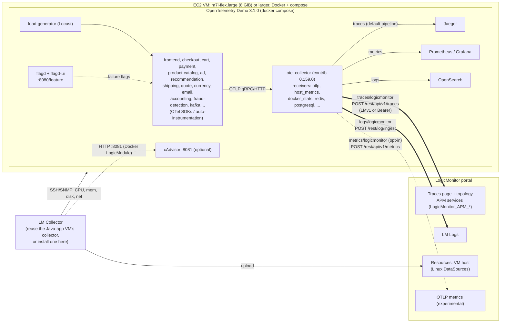

# OpenTelemetry Demo (Astronomy Shop) to LogicMonitor

It runs the CNCF **OpenTelemetry Demo 3.1.0** (about 20 polyglot microservices plus Kafka,
Postgres, Valkey, flagd and Envoy) on a single EC2 VM with docker compose. A small,
additive config layer sends its **traces and logs to LogicMonitor**. The demo's built-in
Jaeger, Grafana, Prometheus and OpenSearch keep working unchanged. The LM Collector
monitors the VM itself, and flagd feature flags inject failures for the RCA story.

The main exercise (the Java app in `../shortlink/`) is separate. This one shows the
"bring an existing OpenTelemetry estate into LM without re-instrumenting" conversation.

## What's here

| Path | Purpose |
|---|---|
| `setup.sh` | Clones the demo pinned to tag `3.1.0`, installs the LM layer, validates the collector config with the demo's own collector image, then starts the demo. Flags: `--minimal`, `--with-cadvisor`, `--with-otlp-metrics`, `--no-start`, `--validate-only` |
| `.env.override.example` | Copy to `.env.override`. Holds the LM portal and credentials, pins the image version, and sets `LM_HOST_NAME` |
| `config/otelcol-config-extras.yml` | **Default LM layer.** Adds the `logicmonitor` exporter, plus `traces/logicmonitor` and `logs/logicmonitor` pipelines that run alongside the demo's own pipelines |
| `config/otelcol-config-extras-with-metrics.yml` | Opt-in variant. Also sends OTLP metrics to LM's `/rest/api/v1/metrics`. **Experimental**: LM's public docs don't cover this endpoint yet |
| `config/compose.extras.yaml` | Passes LM env vars to `otel-collector`, stamps `host.name`, raises the collector's memory, and adds an optional cAdvisor service |
| `scripts/validate.sh` | YAML check plus `otelcol-contrib validate` on the full merged stack (base, full, observability and extras) |
| `scripts/lm-smoke-test.py` | Tests the LM credentials and endpoints **before** deploying: sends one log and one span (and optionally one metric) |
| `scripts/flag.sh` | Turns failure flags on and off from the shell, e.g. `scripts/flag.sh paymentFailure 50%` |

## Architecture



ASCII version for a terminal or whiteboard:

```
 load-generator --> [ ~20 demo services, each with an OTel SDK ] <-- flagd (failure flags)
                              | OTLP
                              v
                     otel-collector (contrib 0.159.0)
       demo's pipelines  /    |     \          our pipelines (config/otelcol-config-extras.yml)
                  Jaeger  Prometheus OpenSearch   traces/logicmonitor --> https://<portal>.logicmonitor.com/rest/api/v1/traces
                                                 logs/logicmonitor   --> https://<portal>.logicmonitor.com/rest/log/ingest
                                                 (opt) metrics/lm    --> .../rest/api/v1/metrics   [experimental]
 LM Collector --(SSH/SNMP, optional cAdvisor)--> the VM  --> LM Resources / DataSources / Alerts
```

### Why this design

- **No changes to the demo's own pipelines.** The collector merges config layers but *replaces*
  arrays. If you append an exporter to `service.pipelines.traces.exporters` you must copy the
  upstream list exactly, and if you drop `span_metrics` the collector crashes. Instead the LM
  layer adds two *new* pipelines on the same `otlp` receiver. Jaeger, Grafana and Prometheus
  stay untouched, and LM gets its own queue, retries and an optional sampler. The LM path is
  also unaffected by upstream config changes.
- **Credentials are only in environment variables.** The exporter's SDK (lm-data-sdk-go) reads
  `LOGICMONITOR_ACCESS_ID`/`LOGICMONITOR_ACCESS_KEY` (LMv1, used first) or
  `LOGICMONITOR_BEARER_TOKEN`. No secret goes in YAML.
- **Resource mapping is deliberate.**
  - `compose.extras.yaml` sets `OTEL_RESOURCE_ATTRIBUTES=host.name=<VM hostname>` on the
    collector. Its `resource_detection` `env` detector runs first and overrides by default, so
    every span and log carries the VM's hostname, not a container ID. LM maps `host.name` to
    `system.hostname`, which avoids duplicate resources.
  - For logs, `transform/logicmonitor_logs` trims `_lm.resourceId` to `{"system.hostname": …}`.
    It also copies `service.name`, `service.namespace`, `trace_id` and `span_id` into log
    metadata. Without this the exporter sends *every* resource attribute as the mapping key, and
    the logs end up "deviceless". I confirmed the payloads against a mock endpoint.
- **The PII redaction from the demo is reused** on the LM traces path
  (`transform/redact_sensitive_data` and `redaction`).

## What shows up where in LogicMonitor

| Where in LM | What you'll see | Source |
|---|---|---|
| **Traces** page | Every trace and span, filterable by service, operation, status and duration. Errored spans are flagged. Trace detail is a waterfall with span attributes and events (exception stack traces, e.g. the payment `Invalid token` error) | `traces/logicmonitor` |
| **Traces, topology map** (namespace `opentelemetry-demo`) | A service map built from spans: frontend-proxy → frontend → checkout → payment/cart/shipping/currency/email/product-catalog, kafka → accounting/fraud-detection | spans with `service.namespace=opentelemetry-demo` (set by the demo's `.env`) |
| **Resources** tree, auto-created APM *service* resources | One per `service.name`, with DataSources `LogicMonitor_APM_Services` (Duration, ErrorOperationCount, OperationCount, UniqueOperationCount) and per-operation metrics. These are the **alertable** RED metrics | derived by LM from ingested spans |
| **Resources** tree, the VM | Linux CPU, memory, disk and network DataSources via the LM Collector. With traces mapped by `host.name`, the "Traces for a resource" view lists the operations on this host | LM Collector, plus `host.name` on spans |
| **Logs** page | OTLP logs from accounting, ad, cart, checkout, currency, email, fraud-detection, frontend-proxy, load-generator, payment, product-catalog, quote, recommendation and shipping (per the demo's log-coverage page), mapped to the VM resource, with `service.name` and `trace_id` metadata. Log anomaly detection runs on these | `logs/logicmonitor` |
| **Alerts** | Static or dynamic thresholds on APM `ErrorOperationCount` and `Duration`. Linux host alerts. Optional log alert conditions | LM DataSources |
| (opt-in) metrics | OTLP host, docker and span metrics. Where they show up still needs checking in the portal | `--with-otlp-metrics` |

## Quick start (on the VM)

```bash
git clone <this repo> && cd otel-demo-lm        # or scp the folder
cp .env.override.example .env.override && chmod 600 .env.override && vi .env.override
set -a; . ./.env.override; set +a; python3 scripts/lm-smoke-test.py   # creds OK?
./setup.sh                                       # clone 3.1.0, install LM layer, validate, start
scripts/flag.sh paymentFailure 50%               # inject a failure ...
scripts/flag.sh reset                            # ... and recover
```


## VM sizing (verified 2026-10-06)

- The demo's docs ask for **6 GB RAM** for the app (about 3 GB in minimal mode) and 14 GB of disk.
  The compose memory limits in 3.1.0 add up to about 7.7 GiB. That total includes
  load-generator 1.5 GB, Jaeger 1.2 GB and OpenSearch 1 GB.
- **Recommended: `m7i-flex.xlarge` (4 vCPU / 16 GiB), 30 GB gp3.** That leaves room for the full
  demo, an LM Collector on the same box and failure scenarios that leak memory. It is *not*
  on the free-tier list. On an account on the paid plan it draws down the sign-up credits.
  Roughly $0.19/hr on-demand in us-east-1 (check the console), so about $15 for three days.
- **Free-plan option: `m7i-flex.large` (2 vCPU / 8 GiB).** It is free-tier eligible for accounts
  created on or after 2025-07-15 (eligible types: t3.micro, t3.small, t4g.micro, t4g.small,
  c7i-flex.large, m7i-flex.large). Use 30 GB gp3 plus a 4 GB swap file, and **don't** run the
  LM Collector on it: reuse the Java VM's collector. If it struggles, use `./setup.sh --minimal`.
- **Use a separate VM from the Java app.** The demo uses 6 GB or more, and failure flags such as
  `recommendationCacheFailure` and `emailMemoryLeak` deliberately leak memory. Keep that blast
  radius away from the main exercise. Put both VMs in the same VPC and subnet so one LM
  Collector can monitor both.

## Sources (fetched 2026-10-06)

- OTel Demo releases: https://github.com/open-telemetry/opentelemetry-demo/releases (3.1.0, 2026-09-18)
- Docker deployment, and "Bring your own backend": https://opentelemetry.io/docs/demo/docker-deployment/
- Feature flags: https://opentelemetry.io/docs/demo/feature-flags/, plus `src/flagd/demo.flagd.json` @ 3.1.0
- LogicMonitor exporter (contrib v0.159.0; alpha, traces+logs): https://github.com/open-telemetry/opentelemetry-collector-contrib/tree/v0.159.0/exporter/logicmonitorexporter
- lm-data-sdk-go (auth precedence, `/api/v1/traces`, `/log/ingest`, OTLP metrics `/api/v1/metrics` added in v1.4.0, 2026-08-28): https://github.com/logicmonitor/lm-data-sdk-go
- LM: Trace Data Forwarding without an OTel Collector (`/rest/api/v1/traces`, Bearer): https://www.logicmonitor.com/support/trace-data-forwarding-without-an-opentelemetry-collector
- LM: OTel Collector Installation from Contrib Distribution: https://www.logicmonitor.com/support/opentelemetry-collector-installation-from-contrib-distribution
- LM: OTel Collector for LogicMonitor Overview (lmotel, metrics pipeline example): https://www.logicmonitor.com/support/opentelemetry-collector-for-logicmonitor-overview
- LM: OTel Collector Versions (lmotel 7.0.00, 2026-07-20, built on 0.154.0): https://www.logicmonitor.com/support/opentelemetry-collector-versions
- LM: Traces for a Service / Traces for a Resource (APM metrics, thresholds): https://www.logicmonitor.com/support/tracing/traces-for-a-service and https://www.logicmonitor.com/support/tracing/traces-for-a-resource
- LM: Troubleshooting Traces (`LogicMonitor_APM_Services`, host.name → system.hostname): https://www.logicmonitor.com/support/tracing-troubleshooting
- LM: Usage Reporting for APM Traces (billed per span): https://www.logicmonitor.com/support/usage-reporting-for-apm-traces
- LM: Logs & Traces Role Permissions: https://www.logicmonitor.com/support/logs-traces-role-permissions
- LM: Docker Monitoring (cAdvisor): https://www.logicmonitor.com/support/monitoring/containers/docker-monitoring
- AWS EC2 free tier (post-2025-07-15 list): https://docs.aws.amazon.com/AWSEC2/latest/UserGuide/ec2-free-tier-usage.html, https://aws.amazon.com/free/
- AWS M7i-flex specs: https://aws.amazon.com/ec2/instance-types/m7i/
