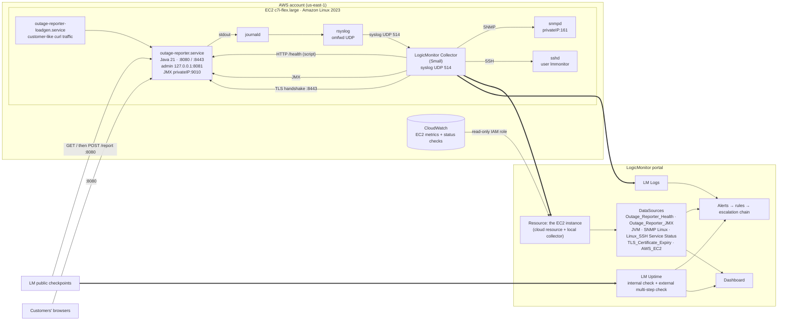
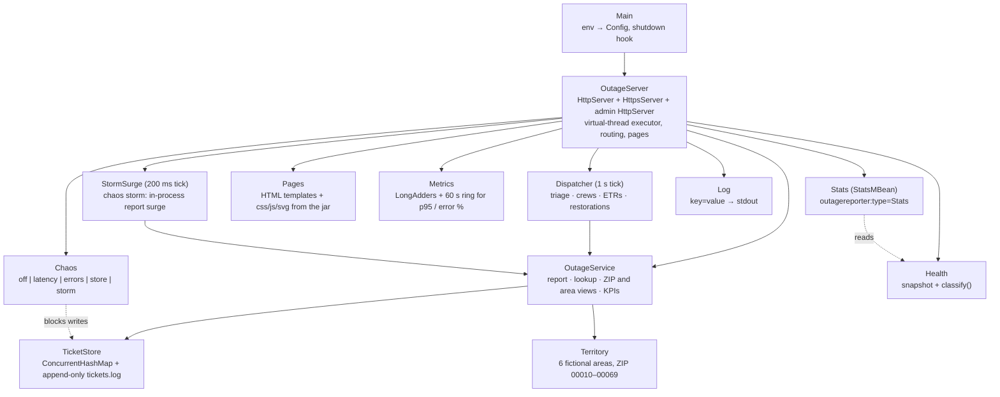

# Outage Reporter: User & Developer Guide

This guide covers how Outage Reporter and its monitoring fit together, from
the code up to the LogicMonitor portal. It explains how to build, deploy and
operate the service, and how to monitor it.

The [README](../README.md) is the design record. It explains *why* the
domain model, health model, datapoint types and thresholds are what they
are. This guide covers *how* and *what to type*.

The infrastructure, the AWS research and the LogicMonitor research come from
[Shortlink](../../shortlink/docs/DOCUMENTATION.md), the URL shortener this
project replaces. What changed is the application on top: a customer-facing
outage service with business datapoints.

---

## Contents

1. [Quick start](#1-quick-start)
2. [Architecture](#2-architecture)
3. [The service](#3-the-service)
4. [AWS: instance, network, deployment](#4-aws-instance-network-deployment)
5. [LogicMonitor: layer by layer](#5-logicmonitor-layer-by-layer)
6. [Alerting: thresholds, timing, routing, dependencies](#6-alerting-thresholds-timing-routing-dependencies)
7. [Operations](#7-operations)
8. [Troubleshooting](#8-troubleshooting)
9. [Ubuntu instead of Amazon Linux](#9-ubuntu-instead-of-amazon-linux)
10. [What was verified, and how](#10-what-was-verified-and-how)
11. [Sources](#11-sources)

---

## 1. Quick start

### Prerequisites

| Tool | Why | Verified with |
|---|---|---|
| JDK 21+ (`javac`, `jar`, `keytool`) | Build, run, tests (tests generate a keystore) | OpenJDK 25 locally; Corretto 21.0.12 on Amazon Linux 2023 |
| Groovy (optional) | Collection-script tests, running the script by hand | Groovy 6.0 (JDK 25); Groovy 4.0.33 (JDK 17); Groovy 2.4.16 (JDK 8) |
| `curl`, `jq` | Poking the API | — |
| podman (optional) | Rehearsing the cloud-init script in `amazonlinux:2023` | podman 5 |

### Five commands

```bash
cd outage-reporter

# 1. Build and run every test (offline, ~15 s)
./run-tests.sh

# 2. Run it locally with chaos enabled, then open http://localhost:8080/
OUTAGE_ADMIN_TOKEN=dev OUTAGE_DATA_DIR=/tmp/outage java -jar build/outage-reporter.jar

# 3. In another shell: report, track, summarise
curl -s -XPOST localhost:8080/api/reports -d '{"zip":"00012","address":"412 Bay St"}' | jq
curl -s localhost:8080/api/reports/<EPL-id> | jq '{status, etr, customersAffected}'
curl -s localhost:8080/api/areas | jq .totals
curl -s localhost:8080/health | jq

# 4. What the LogicMonitor collector will see
groovy scripts/collection.groovy 127.0.0.1:8080

# 5. Break it, watch the script report it, fix it
curl -s -XPOST -H 'X-Admin-Token: dev' 'localhost:8081/admin/chaos?mode=storm'
sleep 50; groovy scripts/collection.groovy 127.0.0.1:8080   # awaitingTriage > 150, status=0
curl -s -XPOST -H 'X-Admin-Token: dev' 'localhost:8081/admin/chaos?mode=off'
```

To generate customer-like traffic locally, run `TARGET=http://127.0.0.1:8080 deploy/loadgen.sh`.

---

## 2. Architecture

### 2.1 Runtime: one VM, four signal paths into LogicMonitor



Key points:

- **One resource, many sources.** The EC2 instance appears once in
  LogicMonitor, discovered by the AWS integration. Turning on *monitoring via
  local collector* for that resource adds the collector-based DataSources
  (SNMP, JMX, script) to the same resource, so there's no duplicate. LM
  documents that this "does not result in double billing".
- **Collector traffic never crosses the security group.** The collector talks
  to the VM's own private IP. Linux delivers that locally, so 161, 9010, 22
  and 514 stay closed to the outside world.
- **Two signals don't depend on the VM.** CloudWatch is read by
  LogicMonitor's cloud collectors through the IAM role, and the external web
  check runs from LogicMonitor's public checkpoints. Both keep working when
  the VM, and the collector on it, are down. See [§6.4](#64-root-cause-and-the-collector-on-the-same-vm).

### 2.2 Layer coverage

| Layer | What answers "is it healthy?" | LogicMonitor feature | Collected by |
|---|---|---|---|
| **VM** (infrastructure) | Running state, EC2 status checks, CPU, network, EBS | AWS cloud monitoring (`AWS_EC2` and related) | LM cloud collectors via CloudWatch |
| **OS** | CPU, memory, filesystems, interfaces, uptime | SNMP Linux modules (LM's primary method); Linux_SSH as a complement | Local collector |
| **OS → service** | Is `outage-reporter.service` active? | Linux_SSH **Service Status** (`systemctl`) | Local collector |
| **Runtime** (JVM) | Heap, GC, threads | LM's built-in JVM/JMX modules via `jmx.port` | Local collector |
| **Application** (technical) | UP/DEGRADED/DOWN, p95, error rate, store, rates | `Outage_Reporter_Health` (script); `Outage_Reporter_JMX` (graph-only) | Local collector |
| **Business** | Reports a minute, customers turned away, open outages, customers affected, triage backlog, oldest outage, missed ETRs, storm response | `Outage_Reporter_Health` (same script, same poll) | Local collector |
| **Customer's view** | Can a customer load the page and submit a report, from inside the VPC and from the internet? | LM Uptime internal web check + external **multi-step** web check | Collector; public checkpoints |
| **Security hygiene** | Certificate days left and trust on :8443 | `TLS_Certificate_Expiry-` (sibling module) | Local collector |
| **Events** | Access logs, reports received, ticket transitions, storm surges, health transitions, chaos, sshd/auth | LM Logs via syslog LogSource | Local collector (UDP 514) |
| **Traces** (optional) | Per-request spans | LM APM via the OpenTelemetry Java agent | Direct OTLP to the portal |

### 2.3 Code architecture



`/health` and the MBean read the same `Health` snapshot. So the script
DataSource, the JMX DataSource and a person running `curl` all see the same
numbers.

**Concurrency.** Tickets are immutable records, so a reader always sees a
whole ticket.
- **Writes** are serialised on the store. A record is appended to the log
  before the in-memory maps are updated, so nothing a customer was told can
  be lost in a restart.
- **New tickets** come from request threads and the storm generator.
- **Changes to existing tickets** come only from the dispatcher. It shares a
  single scheduler thread with the storm generator, so it is the one writer
  of every existing ticket.
- **Aggregates** iterate a live concurrent view of open tickets and never
  block writers.

---

## 3. The service

### 3.1 Web pages

Every page is server-rendered HTML from templates inside the jar, with one
stylesheet and one script. Nothing is fetched from a CDN or any other host,
and a Content-Security-Policy of `default-src 'self'` enforces that.

| Page | Path | What it shows | Without JavaScript |
|---|---|---|---|
| Report an outage | `/` | Form with ZIP (required), street address, mobile number, what happened. Safety callout for downed lines | Posts to `/report` and gets a confirmation page with the ticket number |
| Check status | `/status?ticket=…` or `?zip=…` | **Ticket:** a four-step progress bar with times, ETR (marked "revised" if it slipped), customers affected, last update. **ZIP:** open outages, customers affected, crews working, ETR range. Refreshes every 30 s | A note to turn on JavaScript or call |
| Service areas | `/areas` | Totals (customers without power, open outages, crews, share out) and a table per area with a share-out bar. The six areas are named after LogicMonitor capabilities. Refreshes every 15 s | A note |
| How it's monitored | `/monitoring` | Which LogicMonitor capability watches each part of the site, and why the alerts are designed the way they are | Fully readable; static |

States the audience can see:

- **Loading.** The button spins and reads "Sending your report…" or
  "Checking…". After one second a note says "This is taking longer than
  usual", so the latency fault is visible.
- **Field errors.** The server's message sits next to the field, and the
  field is marked `aria-invalid` and focused.
- **Service failure** (5xx, a timeout or no connection). "Report not sent.
  We can't take your report right now — please try again in a few minutes
  or call 1-800-555-0142."
- **Area view failure.** A red notice says the information is temporarily
  unavailable, and the last good numbers stay on screen with their time.
- **Storm response.** An amber banner on every page: "Storm response in
  effect. We're receiving a very high number of outage reports. Restoration
  times are longer than usual and may change." It is rendered by the server,
  so it works without JavaScript, and the area and ZIP views update it live.

The pages are responsive (the area table becomes stacked cards below 640 px),
keyboard-accessible with visible focus and a skip link, and honour
`prefers-reduced-motion`. A ribbon on every page marks the site as a
LogicMonitor demo. The footer says the utility is fictional and that this is
not an official LogicMonitor site, plus an optional credit line
(`OUTAGE_DEMO_CREDIT`).

### 3.2 HTTP API

| Method & path | Success | Errors |
|---|---|---|
| `POST /api/reports` body `{"zip":"00012","address":"…","phone":"…","notes":"…"}` | `201` ticket JSON + `Location` | `400 {"error","field"}`, `413` body > 8 KB, `503` store unavailable, `500` (chaos) |
| `POST /report` form-encoded, same fields | `200` HTML confirmation with `id="ticket-id"` | `400` HTML naming the problem, `503`/`500` HTML "Report not sent" |
| `GET /api/reports/{id}` (case-insensitive, `EPL-` optional) | `200` ticket JSON | `404` |
| `GET /api/zip/{zip}` | `200` ZIP summary (no ticket IDs: privacy) | `400` not 5 digits, `404` outside the territory |
| `GET /api/areas` | `200` totals and per-area figures, `stormMode` | — |
| `GET /health` | `200` (UP/DEGRADED) or `503` (DOWN), JSON | — |
| `GET /api` | `200` service info | — |
| `GET /`, `/status`, `/areas`, `/static/{app.css,app.js,icon.svg}` | `200` | `404` HTML page for unknown paths |

**Report rules.** These are checked on the server; the messages are shown to
customers as they are.
- **ZIP.** It must be 5 digits; ZIP+4 is cut to five digits. It must be in
  00010–00069, or the synthetic 00099. If the ZIP field is empty, a ZIP at
  the end of the address is used. A JSON number is refused, because `00012`
  would lose its zeros.
- **Phone** is optional. US formats are accepted, with any punctuation and an
  optional `+1`. It is stored as 10 digits and shown as `•••-•••-0123`.
- **Lengths.** The address may be up to 120 characters and the notes up to
  500. Control characters and runs of whitespace are collapsed, so a stored
  field never contains a tab or newline.

**Ticket JSON.**

```json
{"id":"EPL-ZKTW4X","status":"crew_assigned","statusLabel":"Crew assigned","zip":"00012",
 "area":{"id":"edwin","name":"Edwin AI District"},"address":"412 Bay St","phone":"•••-•••-0142",
 "reportedAt":"…","updatedAt":"…","etr":"2026-10-09T15:47:37Z","etrRevisions":1,"customersAffected":86,
 "timeline":[{"status":"reported","label":"Reported","at":"…"}, … four steps, "at": null until reached]}
```

### 3.3 The outage model

| Setting | Default | Meaning |
|---|---|---|
| `OUTAGE_RESTORE_MINUTES` | `8` | Typical confirmation-to-restoration time. The ETR is 0.75–1.25× this, doubled under storm response |
| `OUTAGE_TRIAGE_PER_MINUTE` | `180` | Reports the dispatcher can confirm per minute. The bottleneck a storm exceeds |
| `OUTAGE_TRIAGE_DELAY_SECONDS` | `10` | A report waits at least this long before confirmation, so "Reported" is visible |
| `OUTAGE_DISPATCH_INTERVAL_MS` | `1000` | Dispatcher tick |
| `OUTAGE_STORM_REPORTS_PER_SECOND` / `_RAMP_SECONDS` | `6` / `10` | `chaos storm`: peak surge rate and time to reach it |
| `OUTAGE_STORM_THRESHOLD_PER_MINUTE` | `60` | Reports a minute that declare storm response (banner, doubled ETRs) |

Customers affected per outage is drawn from three sizes:
- **70 %:** one transformer, 1–12 customers.
- **25 %:** a lateral, 20–150 customers.
- **5 %:** a feeder, 300–2,500 customers.

Sums are capped per area at the customers it serves.

| Area | ZIPs | Customers served |
|---|---|---|
| Edwin AI District | 00010–00019 | 412,000 |
| Envision Valley | 00020–00029 | 538,000 |
| Collector Cove | 00030–00039 | 621,000 |
| Uptime Ridge | 00040–00049 | 487,000 |
| Service Insights Park | 00050–00059 | 356,000 |
| LM Logs Landing | 00060–00069 | 586,000 |

The load generator files a report every 7–40 s, depending on the time of
the hour. That keeps roughly 15–75 outages open in steady state. A storm lands 45 % of its reports in
Edwin AI District and 30 % in Envision Valley, the "coast".

### 3.4 Configuration (environment)

All configuration is in `/etc/outage-reporter/outage-reporter.env`. Each
variable is documented in
[`deploy/outage-reporter.env.example`](../deploy/outage-reporter.env.example).

| Variable | Default | Notes |
|---|---|---|
| `OUTAGE_BIND` / `OUTAGE_PORT` | `0.0.0.0` / `8080` | Public listener |
| `OUTAGE_TLS_KEYSTORE` / `_PASSWORD` / `_PORT` | unset / — / `8443` | HTTPS twin, enabled when a keystore is set |
| `OUTAGE_ADMIN_BIND` / `_PORT` / `_TOKEN` | `127.0.0.1` / `8081` / unset | No token means no admin listener |
| `OUTAGE_DATA_DIR` | `data` | systemd sets `/var/lib/outage-reporter` |
| `OUTAGE_DEGRADED_P95_MS` / `_ERROR_PERCENT` / `OUTAGE_WINDOW_SECONDS` | `500` / `5` / `60` | Health rules |
| `OUTAGE_CHAOS_LATENCY_MS` / `_ERROR_PERCENT` | `1500` / `50` | Chaos strength |
| Outage model and storm | see [§3.3](#33-the-outage-model) | |
| `OUTAGE_DEMO_CREDIT` | unset | Optional footer line saying who built the demo and for whom. Set per deployment, so it never lives in the repository |

### 3.5 Logs

There is one line per event on stdout. systemd tags each line
`outage-reporter`, and it flows to journald, then rsyslog, then the
collector, then LM Logs. No log line carries a customer's address or phone
number.

```
ts=2026-10-09T15:02:11.204Z level=INFO event=report_received id=EPL-ZKTW4X zip=00012 area=edwin channel=form synthetic=false
ts=2026-10-09T15:02:21.880Z level=INFO event=ticket_status id=EPL-ZKTW4X status=confirmed area=edwin etr=2026-10-09T15:10:02Z etrRevisions=0 customers=86
ts=2026-10-09T15:05:40.118Z level=WARN event=chaos_mode_changed from=off to=storm
ts=2026-10-09T15:05:40.301Z level=WARN event=storm_surge_started peakReportsPerSecond=6 rampSeconds=10
ts=2026-10-09T15:05:50.302Z level=INFO event=storm_surge reportsPerSecond=6.0 reports=31 total=31
ts=2026-10-09T15:09:12.009Z level=ERROR event=store_write_failed error="simulated store failure (chaos mode store)"
ts=2026-10-09T15:09:12.640Z level=ERROR event=dispatcher_paused error="simulated store failure (chaos mode store)"
```

| Event | Level | When |
|---|---|---|
| `started` / `stopped` | INFO | Lifecycle. `started` includes tickets loaded and open |
| `access` | INFO | Every public request except `/health` |
| `report_received` | INFO | A report via the form or API (`channel`, `synthetic`) |
| `ticket_status` | INFO | A customer ticket moves (confirmed, crew_assigned, restored), with ETR and impact. Storm tickets aren't logged one by one |
| `storm_surge_started`, `storm_surge_ended` | WARN | The surge starts or stops |
| `storm_surge` | INFO | Every 10 s during a surge: rate and count |
| `health_changed` | WARN | Status transition, with the numbers that caused it |
| `chaos_mode_changed`, `admin_unauthorized` | WARN | Fault injection and failed admin attempts |
| `store_records_skipped`, `store_reopen_failed` | WARN | Recovered from a torn write; store still failing |
| `dispatcher_resumed` | INFO | The store took writes again |
| `store_write_failed`, `dispatcher_paused`, `request_failed`, `startup_failed`, `background_task_failed` | ERROR | Something broke |

Useful LM Logs queries: `event=report_received`, `event=storm_surge`,
`event=ticket_status status=restored`, `event=health_changed`,
`level=ERROR`, `status=500`.

### 3.6 JMX

The MBean is `outagereporter:type=Stats`. Every attribute LogicMonitor should
graph is numeric:

| Attribute | Type | Meaning |
|---|---|---|
| `StatusCode` | int | 0 UP, 1 DEGRADED, 2 DOWN |
| `UptimeSeconds`, `RequestsTotal`, `ErrorsTotal`, `ClientErrorsTotal`, `ReportsTotal` | long | |
| `Tickets`, `OpenOutages`, `AwaitingTriage`, `OverdueOutages` | int | |
| `ReportsLastMinute`, `FailedReportsLastMinute`, `CustomersAffected` | long | |
| `P95LatencyMs`, `ErrorRatePct`, `OldestOpenMinutes` | double | |
| `StoreOk`, `StormMode` | int | 1 / 0. Ints, not booleans, so the collector reads a number |
| `ChaosModeCode` | int | 0 off, 1 latency, 2 errors, 3 store, 4 storm |
| `Status`, `ChaosMode` | String | For people using jconsole |

These are the JVM flags, as set by cloud-init in `JMX_OPTS`:

```
-Dcom.sun.management.jmxremote.port=9010
-Dcom.sun.management.jmxremote.rmi.port=9010      # same port: one port to reason about
-Dcom.sun.management.jmxremote.host=<private-ip>  # bind only there, not 0.0.0.0
-Djava.rmi.server.hostname=<private-ip>           # the address RMI hands back to clients
-Dcom.sun.management.jmxremote.authenticate=false
-Dcom.sun.management.jmxremote.ssl=false
```

Why the private IP and not `127.0.0.1`? The collector connects to
`##HOSTNAME##`, the resource's hostname, which for the EC2 resource is its
private address. If JMX were bound to loopback only, the collector couldn't
reach it. Binding to the private IP, with 9010 closed in the security group,
keeps JMX local to the VM in practice. `ProcessTest` launches the real jar
with exactly these flags, on loopback, and reads both
`outagereporter:type=Stats` and `java.lang:type=Memory` over remote JMX.

### 3.7 Fault injection

```bash
sudo chaos latency    # or: errors | store | storm | off;  no argument shows the current mode
```

`/usr/local/bin/chaos` reads the token from the env file and calls the admin
listener on loopback. It needs `sudo` because the env file is mode 0640,
owned by `root:outage`.

---

## 4. AWS: instance, network, deployment

### 4.1 Account and credits (verified 2026-10-06)

Accounts created on or after 15 July 2025 work like this:

- **Credits.** You get USD 100 in credits at sign-up, and up to another USD
  100 for completing activities. Launching and terminating an EC2 instance is
  one of them, worth USD 20.
- **Free plan.** It "ensures you won't incur any charges". It ends after six
  months or when the credits are used up.
- **Paid plan.** Credits are used first, then normal pay-as-you-go pricing.

Source:
[docs.aws.amazon.com/.../free-tier-plans.html](https://docs.aws.amazon.com/awsaccountbilling/latest/aboutv2/free-tier-plans.html).
The free-tier-eligible EC2 types for these accounts are `t3.micro`,
`t3.small`, `t4g.micro`, `t4g.small`, `c7i-flex.large` and `m7i-flex.large`
([EC2 free tier usage](https://docs.aws.amazon.com/AWSEC2/latest/UserGuide/ec2-free-tier-usage.html)).

### 4.2 Instance type: **c7i-flex.large** (2 vCPU, 4 GiB)

| Type | vCPU / RAM | us-east-1 Linux $/h | ≈ $/week | Fits app + collector? |
|---|---|---|---|---|
| t3.micro / t4g.micro | 2 / 1 GiB | 0.0104 / 0.0084 | 1.75 / 1.41 | No |
| t3.small / t4g.small | 2 / 2 GiB | 0.0208 / 0.0168 | 3.49 / 2.82 | No: a Small collector alone is about 2 GB |
| **c7i-flex.large** | **2 / 4 GiB** | **0.08479** | **14.24** | **Yes, with about 1 GB of headroom** |
| m7i-flex.large | 2 / 8 GiB | 0.09576 | 16.09 | Yes, with plenty to spare |

The reasoning is the same as Shortlink's:

- **The collector sets the size.** LogicMonitor's Small collector "consumes
  approximately 2GB system memory". Nano is "intended for testing purposes
  and not recommended for production"
  ([adding-collector](https://www.logicmonitor.com/support/adding-collector),
  [collector-capacity](https://www.logicmonitor.com/support/collector-capacity)).
- **LM advises against burstable instances.** It says "Avoid burstable,
  shared-core, or CPU-credit-based instances" and recommends "AWS C- and
  M-series".
- **Outage Reporter is about as small as Shortlink.** It has a 256 MB heap.
  Even after a long storm it holds a few thousand tickets of about 300 bytes
  each.
- **It's cheap.** About $16 a week all in, against $100–$200 of credits.

Choose **x86_64** Amazon Linux 2023. If you stop the instance before the
demo, allocate an **Elastic IP**, because the certificate SANs and the
external check URL contain the address. Run `sudo outage-cert` after you
associate it.

### 4.3 Security group

The rules are the same as for Shortlink, so a security group you already
made for it (`shortlink-demo`) fits as it is:

| Port | Source | Why |
|---|---|---|
| 22/tcp | **My IP /32** only | SSH, plus `push.sh` |
| 8080/tcp | 0.0.0.0/0 | The customer pages and the external web check from LM checkpoints. The admin endpoints are not on this port |
| 8443/tcp | My IP /32 (or 0.0.0.0/0 for the demo) | HTTPS twin. The collector reaches it internally either way |
| 161, 514, 8081, 9010 | **not opened** | SNMP, syslog, admin and JMX are reached only from the VM itself |

Outbound: leave the default (all). The collector needs HTTPS (443) out to
`<portal>.logicmonitor.com`.

### 4.4 Launch

1. `deploy/make-user-data.sh` writes `build/user-data.sh`, which is 14,011
   bytes; EC2's limit is 16 KB.
2. In the EC2 console, choose **Launch instance**:
   - Name `outage-reporter-demo`. Add the tag `Application=outage-reporter`.
   - AMI: Amazon Linux 2023 (x86_64). Type: `c7i-flex.large`.
   - Key pair: reuse `shortlink-demo` if you already have it, or create one.
   - Network: default VPC, public subnet, auto-assign public IP, the
     security group from [§4.3](#43-security-group).
   - Storage: 30 GiB gp3.
   - Advanced → **Metadata version: V2 only**. **User data**: paste
     `build/user-data.sh`.
3. Wait for the status checks to show 2/2. Then:

   ```bash
   deploy/push.sh ec2-user@<public-dns> ~/.ssh/shortlink-demo.pem
   # prints the /health JSON when the service is up
   open http://<public-dns>:8080/          # the customer page
   ssh -i ~/.ssh/shortlink-demo.pem ec2-user@<public-dns> sudo cat /root/outage-reporter-lm-properties.txt
   ```

`push.sh` waits for cloud-init to finish, installs the jar and restarts the
service and the load generator. Run it again whenever you rebuild.

What cloud-init sets up (template: `deploy/cloud-init/user-data.template.sh`):

| Item | Where |
|---|---|
| Corretto 21 headless, rsyslog, net-snmp, jq, xxd (the collector installer needs it) | dnf |
| 1 GB swap | `/swapfile` |
| `outage` system user, `/opt/outage-reporter`, `/etc/outage-reporter` (0750) | |
| Self-signed RSA-2048 certificate, **25 days** (under the 30-day warning threshold), with SANs for the public DNS name, public IP, private IP and localhost. `sudo outage-cert [days]` regenerates it from the current addresses | `/etc/outage-reporter/tls.p12`, `/usr/local/sbin/outage-cert` |
| Env file with a generated admin token and keystore password | `/etc/outage-reporter/outage-reporter.env` |
| `outage-reporter.service`, `outage-reporter-loadgen.service` (enabled, started by push.sh) | `/etc/systemd/system/` |
| `chaos` helper | `/usr/local/bin/chaos` |
| rsyslog forwarding to `<private-ip>:514/udp` | `/etc/rsyslog.d/60-outage-reporter-lm.conf` |
| snmpd v2c, generated community, answers only the VM's own addresses | `/etc/snmp/snmpd.conf` |
| `lmmonitor` user with a PEM key for LM's Linux SSH modules | `/etc/lm-ssh/` |
| The LM properties to set, with the generated values | `/root/outage-reporter-lm-properties.txt` |

**If a Shortlink instance is still running**, launch a new instance for
Outage Reporter rather than converting the old one. The paths, the service
user and the properties all differ. Terminate the Shortlink instance once the
new one is up, so it stops using credits. If the old one is already in
LogicMonitor, delete that resource, or move its properties across.

---

## 5. LogicMonitor: layer by layer

The order below is the one the runbook follows. Each step ends with what you
should see. Menu paths are written from the documentation; the portal UI may
label them slightly differently.

### 5.1 Collector

1. **Settings → Collectors → Add**, Linux, **size Small**. Copy the install
   command the portal gives you.
2. On the VM, run it (`sudo bash LogicMonitor_Collector_*.bin -y`), then
   `sudo systemctl status logicmonitor-agent`.
3. Check: the collector shows as up in the portal, with a recent heartbeat.

If the installer offers to add its own host as a resource, **decline**, or
delete the result afterwards. The VM should be represented by its AWS cloud
resource.

### 5.2 AWS cloud monitoring: the VM layer

1. **Resources → Add → Cloud and SaaS → AWS**. The wizard shows LM's
   **Account ID** and an **External ID**.
2. In AWS IAM, create a role for **another AWS account** with that account ID
   and *Require external ID*. Attach **`ReadOnlyAccess`**, or LM's tighter
   minimal policy, and paste the role ARN back into LM.
3. Limit the integration to **EC2** and **your region**.
4. Check: the instance appears under the AWS group with `AWS_EC2`
   datapoints.
5. Open that resource, then **Collector Assignments**, and turn on **Enable
   Monitoring via local Collector** with the collector from §5.1.

### 5.3 Properties on the EC2 resource

Copy these from `/root/outage-reporter-lm-properties.txt`:

```
outage.port         = 8080                         → Outage_Reporter_Health, Outage_Reporter_JMX
jmx.port            = 9010                         → JVM modules, Outage_Reporter_JMX
snmp.version        = v2c
snmp.community      = <generated>                  → SNMP Linux modules
ssh.user            = lmmonitor
ssh.cert            = /etc/lm-ssh/lmmonitor_id_rsa → Linux_SSH modules
linux.ssh.services  = outage-reporter.service      → Service Status discovery
tls.endpoints       = <public-dns>:8443            → TLS_Certificate_Expiry-
```

`outage.host` is optional. It overrides `system.hostname` as the script's
target when they differ.

### 5.4 OS layer

**SNMP (primary).** LogicMonitor's Linux SSH page says the SSH package "is
designed only for the systems where SNMP is not configured". Once `snmp.*`
is set, run **Active Discovery** and expect CPU, memory, filesystems and
interfaces. To check from the VM:

```bash
snmpget -v2c -c <community> <private-ip> SNMPv2-MIB::sysDescr.0
```

**Linux SSH (complement): Service Status** for `outage-reporter.service`. The
`lmmonitor` user is unprivileged and its key is PEM (`ssh-keygen -m PEM`), as
LM requires. On an EC2 resource you may have to add `Linux_SSH` to
`system.categories` by hand. That's an inference from the
`addCategory_Linux_SSH` PropertySource excluding AWS hosts; confirm it in
the portal.

### 5.5 Runtime layer: JVM via JMX

- **Built-in JVM modules.** With `jmx.port=9010` set, LM's JMX modules
  discover heap, GC, threads and class loading through
  `service:jmx:rmi:///jndi/rmi://##HOSTNAME##:##jmx.port##/jmxrmi`. The exact
  module names weren't verified from the docs.
- **`Outage_Reporter_JMX` (optional, graph-only).** Build it from
  [`module/Outage_Reporter_JMX.json`](../module/Outage_Reporter_JMX.json),
  with MBean `outagereporter:type=Stats` and the attribute in **separate
  fields**. Use the same types as the script: derive with a minimum of 0
  for the `*Total` counters, gauge for everything else. It has no thresholds,
  so it adds no duplicate alerts.

### 5.6 Application and business layer: `Outage_Reporter_Health`

`module/Outage_Reporter_Health.json` is this repo's spec of the module, in
the same layout as `lm-tls-cert-expiry`. It is not an LM export. To build it:

1. **Modules → Add → DataSource.** Name `Outage_Reporter_Health`, display
   name `Outage Reporter Health`, group `Outage Reporter`. Collect every
   **1 minute**. Turn **Multi-instance off**.
2. AppliesTo: `outage.port =~ "^[0-9]+$"`
3. Collector: **Script → Embedded Groovy**. Paste
   [`scripts/collection.groovy`](../scripts/collection.groovy) **unchanged**.
4. Datapoints: add one per entry in the JSON, each a normal datapoint with
   *Key-Value pairs* and the given key.
   - **Types.** Everything is a gauge except `requestRate`,
     `serverErrorRate` and `clientErrorRate`. Those three are **derive**
     with **valid value range min 0**.
   - **Thresholds:**

     | Datapoint | Threshold |
     |---|---|
     | `reachable` | `!= 1` critical |
     | `storeOk` | `!= 1` critical |
     | `p95LatencyMs` | `> 500 1000` |
     | `errorRatePct` | `> 5 20` |
     | `responseTimeMs` | `> 2000` warning |
     | **`awaitingTriage`** | **`> 60 150`** |
     | **`oldestOpenMinutes`** | **`> 60` warning** |

   - Copy the per-datapoint alert subjects and bodies. The business ones say
     what to do, not just what broke.
5. Save. **Test Script** against the EC2 resource should print the same lines
   as `groovy scripts/collection.groovy <private-ip>:8080` run on the VM.
6. Check, within two polls:
   - `requestRate` is around 1–3/s and `clientErrorRate` slightly above zero.
   - `reportsLastMinute` is about 1–9, and `openOutages` is rising towards
     its steady state of 15–75.
   - `awaitingTriage` is 0–5, and `status`, `chaosMode` and `stormMode` are 0.

### 5.7 Certificate layer: `TLS_Certificate_Expiry-`

With `tls.endpoints = <public-dns>:8443` you should see:
- `handshakeOk=1`.
- `daysUntilExpiry` of 25 or less, which raises the **warning** (below 30).
- **`chainTrusted=0`**, which raises an **error**. That alert is honest: the
  certificate is self-signed. In production you'd use ACM or ACME.

### 5.8 Synthetic checks: LM Uptime

LogicMonitor web checks support multiple steps. Each step can use GET, HEAD
or POST, send form-encoded POST data, check the expected status codes and
match text in the response. "Follow redirect" is on by default, and internal
checks offer the same per-step options as external ones. Sources are in
[§11 Sources](#11-sources).

| Check | Steps | Settings | Shows |
|---|---|---|---|
| **Internal web check** (from the collector) | GET `http://<private-ip>:8080/health`, expect 200 | 1 min | Reachability inside the VPC, independent of the script |
| **External web check** (LM checkpoints): *the customer journey* | 1. GET `http://<public-dns>:8080/`, expect 200, response contains `Report a power outage`. 2. POST `http://<public-dns>:8080/report`, POST data *x-www-form-urlencoded*: `zip=00099`, `notes=LogicMonitor web check`; expect 200, response contains `Report received` | 1 min (or 5 to keep synthetic volume down); all checkpoints; alert after 2 consecutive failures | Whether a customer on the internet can load the page *and* submit a report. Survives the VM and collector being down |

Notes on the external check:

- **ZIP 00099 is the synthetic ZIP.** Its tickets are stored, which proves
  the write path, then closed on the next dispatcher tick. They never count
  in any business figure. Five checkpoints a minute add about 7,200 small
  log records a day.
- **Step 2 fails when the store is broken** (`503`), so this check goes red
  for the `store` fault, after about 2–3 minutes. The DataSource names the
  cause first.
- **Under `errors` (50 %), a single checkpoint fails about half its POSTs.**
  How often that alerts depends on the check's location condition. With the
  default, all locations, a run of failures across every checkpoint is
  rare. If you set it to "any location", expect a second alert during the
  `errors` demo.
- **Latency doesn't fail the check.** Responses are just 1.5 s slower; show
  that as the check's response-time graph.

LM says not to edit the LM Uptime DataSources' own thresholds. The
effective transition time is the polling interval × the number of failed
checks.

### 5.9 LM Logs

1. **Collector side.** LogicMonitor recommends a **syslog LogSource**: "Every
   LM Collector includes a pre-configured default LogSource for syslog
   ingestion". The collector listens on **UDP 514**.
2. **Resource mapping.** rsyslog sends RFC 5424 messages whose HOSTNAME is the
   VM's name (`ip-172-31-…`), which VPC DNS resolves to the private IP. Map
   by **IP**, or use the *Static* or *LM Property* method if logs arrive
   unmapped.
3. **Check.** Run `logger -t outage-reporter "test from $(hostname)"` and
   look for it on the resource. Then try `event=report_received` and
   `event=ticket_status`.

### 5.10 Dashboard: "Outage Reporter: customer service health"

Put the business row first. It is what a utility executive asks about.

| Row | Widgets |
|---|---|
| 1 (customers) | **Big Number** `customersAffected` · **Big Number** `openOutages` · **Big Number** `reportsLastMinute` · **Big Number** `failedReportsLastMinute` · **Website Status** external check |
| 2 (capacity) | **Custom Graph** `awaitingTriage` with 60/150 reference lines, overlaid with `reportsLastMinute` · **Custom Graph** `oldestOpenMinutes` and `overdueOutages` · `stormMode` as a status indicator |
| 3 (golden signals) | **Custom Graph** `requestRate`, `serverErrorRate`, `clientErrorRate` · **Custom Graph** `p95LatencyMs` with 500/1000 lines · **Custom Graph** `errorRatePct` · **Alert List** filtered to the resource |
| 4 (runtime and OS) | JVM heap used versus max · GC time · CPU and memory (SNMP) · filesystem `/` % used |
| 5 (VM and context) | `AWS_EC2` CPUUtilization, StatusCheckFailed · `chaosMode`, `uptimeSeconds` · Logs widget filtered to `event=health_changed` or `event=storm_surge_started`, if your portal has one |

### 5.11 Optional: traces into LM APM (OpenTelemetry)

This is unchanged from Shortlink: the OpenTelemetry Java agent sends OTLP
directly to `https://<portal>.logicmonitor.com/rest/api` with a bearer
token, with `-Dotel.service.name=outage-reporter`. Do it only if Thursday is
ahead of plan. It's **unverified** whether the agent instruments the JDK's
`com.sun.net.httpserver`. See the Shortlink guide's §5.11 for the full flag
list.

---

## 6. Alerting: thresholds, timing, routing, dependencies

### 6.1 Thresholds

| Source | Datapoint / check | Warning | Error | Critical |
|---|---|---|---|---|
| Outage_Reporter_Health | `reachable` | | | `!= 1` |
| Outage_Reporter_Health | `storeOk` | | | `!= 1` |
| Outage_Reporter_Health | `p95LatencyMs` | `> 500` | `> 1000` | |
| Outage_Reporter_Health | `errorRatePct` | `> 5` | `> 20` | |
| Outage_Reporter_Health | `responseTimeMs` | `> 2000` | | |
| Outage_Reporter_Health | **`awaitingTriage`** | **`> 60`** | **`> 150`** | |
| Outage_Reporter_Health | **`oldestOpenMinutes`** | **`> 60`** | | |
| TLS_Certificate_Expiry- | `daysUntilExpiry` / `chainTrusted` | `< 30` | `< 14` / `!= 1` | `< 7` |
| LM Uptime | internal and external web checks | | | after 2 consecutive failures |
| SNMP / AWS / JVM | LM defaults | Keep them | | |

### 6.2 Expected timing (60 s collection, trigger and clear "immediately")

| Action | What the customer sees | Alert expected | Clears after the fix |
|---|---|---|---|
| `sudo chaos latency` | The spinner, then "taking longer than usual"; the report still goes through | `p95LatencyMs` **error** on the next poll: **≤ 60 s** | `chaos off`, then the 60 s window rolls off, then the next poll: **60–120 s** |
| `sudo chaos errors` | About half of submissions: "Report not sent… call 1-800-555-0142" | `errorRatePct` **error**: ≤ 60 s. `failedReportsLastMinute` climbs without a second alert | 60–120 s |
| `sudo chaos storm` | Storm banner within about 15 s; area figures climb | `awaitingTriage` warning at about 17 s, **error at about 45 s**, so on the first poll after that: **45–105 s**. Every technical datapoint stays green | The queue drains at 3 a second: the error clears when it's below 150 and the warning when it's below 60. Turned off 30–60 s after the alert: **about 1–2 min** |
| `sudo chaos store` | Every submission refused; lookups work | `storeOk` **critical**: ≤ 60 s. External check step 2 fails: ~2–3 min | Next poll: ≤ 60 s |
| `sudo systemctl stop outage-reporter` | The browser can't connect | `reachable` **critical**: ≤ 60 s. Web checks: ~2–3 min. JMX goes to No Data | `systemctl start`: next poll |

**Storm timeline, measured** on this service at default settings, with
`/health` sampled every 5 s:

| Time after `chaos storm` | `awaitingTriage` |
|---|---|
| 10 s | 34 |
| 20 s | 83 (warning) |
| 45 s | 156 (error) |
| 120 s | 393 |

`chaos off` came at 131 s, with the queue at 423. The queue then fell below
150 at 98 s after that, below 60 at 130 s, and reached zero at 152 s. So
turn the storm off soon after the alert lands. Every minute it runs adds
about another minute to the clear.

**Use Poll Now** on the instance's Raw Data tab to collect immediately rather
than wait for the next 60 s poll.

For production, set the trigger interval to **2 polls** on `p95LatencyMs`,
`errorRatePct` and `awaitingTriage`.

### 6.3 Rules and escalation chain

- **Escalation chain** `Outage Reporter on-call`: stage 1 emails you.
  Escalation interval: 15 minutes.
- **Alert rule** `Outage Reporter critical/error`: priority 10, matching the
  resource, severity **error and above**, routed to the chain.
- **Warnings** don't page. They show on the dashboard and the alert list.
- Rules are evaluated in priority order, lowest number first, so make sure no
  broader rule catches these first.

### 6.4 Root cause, and the collector on the same VM

This is unchanged from Shortlink, and it's worth saying out loud in the
demo: **the collector runs on the VM it monitors.** When the VM goes down:

- **The collector goes with it.** No collector-based DataSource reports
  anything, so there's no Outage_Reporter_Health alert at all. The danger is
  silence, not noise.
- **What still fires:**
  - the **collector-down** alert;
  - **AWS_EC2** status-check and state datapoints, read via CloudWatch;
  - the **external web check** from public checkpoints, which is the
    customer-journey check here.
- **HostStatus is not a demo-able signal here.** It depends on a collector
  that can see the host. LM suppresses notifications once a host has been
  unreachable for six minutes and then raises the HostStatus critical. A
  newly added device needs at least 30 minutes of inaccessibility.
- **In production**, run two collectors in a collector group elsewhere. Then
  a VM failure raises `HostStatus` on the VM, and **Dependent Alert Mapping**
  (Enterprise) marks the application alerts behind it as dependent, so only
  the root cause pages.

Without DAM, use alert rules for `AWS_EC2` state and status checks, and an
**SDT** for planned work.

---

## 7. Operations

### 7.1 Everyday commands (on the VM)

```bash
systemctl status outage-reporter outage-reporter-loadgen
journalctl -u outage-reporter -f                       # live key=value log
journalctl -u outage-reporter --since -10min | grep -E 'level=(WARN|ERROR)'
curl -s localhost:8080/health | jq
curl -s localhost:8080/api/areas | jq .totals
sudo chaos                                             # current chaos mode
sudo systemctl restart outage-reporter                 # counters reset; tickets persist
ls -lh /var/lib/outage-reporter/tickets.log
```

### 7.2 Restart behaviour

- `Restart=on-failure`. A crash or `kill -9` comes back in 5 s. `systemctl
  stop` stays stopped.
- The JVM exits **143** after its shutdown hook on SIGTERM, and the unit has
  `SuccessExitStatus=143`. `ProcessTest` checks this.
- On start, the store replays `tickets.log`. A torn last line is skipped and
  counted (`store_records_skipped`). The dispatcher then works through
  whatever is overdue: tickets past their ETR are restored on the first few
  ticks.

### 7.3 Memory budget (c7i-flex.large, 4 GiB)

| Process | Approx. |
|---|---|
| LogicMonitor collector (Small) | ~2 GB (LM's figure) |
| Outage Reporter JVM (`-Xmx256m`) | ~0.4–0.5 GB |
| OS, sshd, rsyslog, snmpd, journald | ~0.3–0.5 GB |
| Headroom + 1 GB swap | ~0.8 GB + swap |

### 7.4 Hardening JMX

```bash
sudo tee /etc/outage-reporter/jmxremote.password <<< 'lmmonitor <strong-password>'
sudo tee /etc/outage-reporter/jmxremote.access   <<< 'lmmonitor readonly'
sudo chown outage:outage /etc/outage-reporter/jmxremote.* && sudo chmod 0400 /etc/outage-reporter/jmxremote.*
# In JMX_OPTS: authenticate=true plus
#   -Dcom.sun.management.jmxremote.password.file=/etc/outage-reporter/jmxremote.password
#   -Dcom.sun.management.jmxremote.access.file=/etc/outage-reporter/jmxremote.access
```

Then set `jmx.user` and `jmx.pass` on the resource.

### 7.5 Cost control and teardown

- AWS Budgets: a $20 monthly budget with an email at 50 %, if not already set
  up for Shortlink.
- When you're done, terminate the instance, release any Elastic IP,
  delete the IAM role, and remove the AWS integration from LogicMonitor.

---

## 8. Troubleshooting

| Symptom | Cause | Fix |
|---|---|---|
| `push.sh` hangs at `cloud-init status --wait` | First boot is still installing | Wait, or `sudo tail -f /var/log/cloud-init-output.log` |
| `systemctl status outage-reporter` says *condition failed* | The jar isn't there yet | Run `deploy/push.sh` |
| `startup_failed ... Address already in use` | Another process has 8080, 8081 or 8443 (an old Shortlink on the same box?) | `sudo ss -lntp \| grep -E ':(8080\|8081\|8443\|9010)'` |
| The page loads but submitting says "Report not sent" | A chaos mode is on, or the store is failing | `sudo chaos`; `curl -s localhost:8080/health \| jq .storeOk` |
| `reachable=0` but curl on the VM works | `system.hostname` isn't an address the app listens on | Set `outage.host` to the private IP |
| The DataSource doesn't apply | `outage.port` missing or not numeric, or local collector monitoring is off | Check the property; [§5.2](#52-aws-cloud-monitoring-the-vm-layer) step 5 |
| `awaitingTriage` alert won't clear after `chaos off` | The queue is still being worked off at 3 a second | Expected: about (backlog − 150) ÷ 3 seconds for the error ([§6.2](#62-expected-timing-60-s-collection-trigger-and-clear-immediately)) |
| `oldestOpenMinutes` warning after the VM was stopped overnight | Reports waiting for triage at the stop get a fresh ETR on start | Clears within about 10 minutes as they restore |
| `p95LatencyMs` alert won't clear after `chaos off` | The 60 s window still holds slow samples | Wait up to two minutes |
| External check fails on step 2 only | Store fault, or a wrong POST data type | `curl -s -d 'zip=00099' http://<public-dns>:8080/report \| grep 'Report received'`; set POST data to x-www-form-urlencoded |
| JVM / JMX modules show No Data | JMX bound to a different IP than the collector uses | `sudo ss -lntp \| grep 9010`; match the `JMX_OPTS` IPs to the resource's hostname |
| SNMP modules don't appear | Community or version mismatch | `snmpget` from [§5.4](#54-os-layer) |
| No logs in LM Logs | LogSource not active, or a mapping mismatch | `sudo ss -lunp \| grep 514`; `logger -t outage-reporter hi`; check the mapping |
| `chainTrusted=0` on `:8443` | Self-signed certificate (by design) | [§5.7](#57-certificate-layer-tls_certificate_expiry-) |

---

## 9. Ubuntu instead of Amazon Linux

The user data targets Amazon Linux 2023. The Ubuntu 24.04 differences are
the same as for Shortlink:
- **Packages:** `openjdk-21-jre-headless snmpd snmp jq xxd`.
- **Service user shell:** `/usr/sbin/nologin`.
- **Default SSH user:** `ubuntu`.
- **SNMP:** keep the template's `agentaddress` line, because Ubuntu's default
  is loopback only.

---

## 10. What was verified, and how

**Tested locally (this repository), 2026-10-06:**

- **`./run-tests.sh`:** 71 JDK tests and 9 collection-script tests, all
  passing.
- **`scripts/collection.groovy` in podman,** against a live instance (healthy,
  storm, store) and against a closed port:
  - Groovy 2.4.16 / JDK 8 (`groovy:2.4-jdk8`);
  - Groovy 4.0.33 / JDK 17 (`groovy:4.0-jdk17`).
- **`build/user-data.sh` end to end in `amazonlinux:2023`,** with
  `systemctl` stubbed. `hostname` and `openssh-clients`, which the AMI has
  but the container image lacks, were installed first. Checked:
  - Corretto 21.0.12, and the keystore valid 25 days with its SANs;
  - the env file (0640 root:outage), `rsyslogd -N1`, snmpd answering
    `snmpget` with the generated community, and the PEM SSH key;
  - the app running as `outage` from the env file, with JMX bound to the
    container's IP and HTTPS on 8443;
  - the page and the form POST answering;
  - `chaos storm` / `chaos` / `chaos off`, and loadgen filing reports.
- **Both unit files pass `systemd-analyze verify`.** The only warning is
  that the loadgen path doesn't exist on the build machine.
- **The pages were rendered in a headless browser:**
  - report, status (ticket and ZIP), service areas, and areas at phone
    width;
  - the storm banner;
  - the JavaScript submit flow, driven in the page, both successful and
    under `chaos store`;
  - the loading states.
- **The storm timeline was measured in real time at default settings**
  ([§6.2](#62-expected-timing-60-s-collection-trigger-and-clear-immediately)).

**Checked against vendor documentation on 2026-10-06:**
- Everything Shortlink checked: AWS free tier and instance types, LM
  collector sizing, SNMP-first Linux, JMX, syslog LogSource, LM Uptime,
  derive and valid range, DAM and HostStatus.
- New for this project:
  - LM web checks: multiple steps, GET/HEAD/POST per step, form-encoded POST
    data, expected status codes and text match, Follow redirect on by
    default, and the same options on internal checks;
  - the 555-0100–0199 phone numbers reserved for fictional use;
  - the lowest real ZIP code, 00501.

URLs and quotes are in [§11 Sources](#11-sources).

**Not verified, so confirm in the portal:**

- the exact UI labels for a web check step's POST data format (the
  x-www-form-urlencoded type is from LM's API docs and a worked form-login
  example);
- whether LM Uptime's text match supports regex (only plain text is needed
  here);
- whether there are five public checkpoints (UI docs) or six (older API
  docs);
- the exact names of LM's built-in JVM modules;
- whether `Linux_SSH` must be added to `system.categories` on an EC2
  resource;
- the LogSource mapping method that works first time, and the checkpoint IP
  list;
- whether the OTel Java agent instruments `com.sun.net.httpserver`;
- that 00010–00099 will never be assigned. The published fact is that the
  lowest ZIP is 00501, not that lower numbers are reserved.

---

## 11. Sources

All of these were checked 2026-10-06. The AWS and LogicMonitor
infrastructure sources are the same as Shortlink's and are listed in full in
[Shortlink's runbook](../../shortlink/docs/#11-sources). They cover
free tier plans and eligible types, EC2 prices, user data, Corretto, LM
collector sizes and capacity, Linux via SSH, credentials properties, JMX,
AWS setup, the syslog LogSource, web checks, datapoints, the Groovy 4
collector, DAM, HostStatus, alert rules and OTLP.

**New for this project**

- **LM web check steps:**
  <https://www.logicmonitor.com/support/web-check-steps-analysis-in-lm-uptime>.
  Quotes:
  - "In the Method field, select the HTTP method (GET, HEAD, or POST) that
    must be used to make the request";
  - "If you select the POST option, additional configurations display that
    allow you to specify the data to be included in the request payload";
  - "Toggle on the Follow redirect switch … This toggle is on by default";
  - "If no status is specified, a 200/OK response is expected";
  - "specify format-specific criteria that must be included in (or absent
    from) the response … the entry is case-sensitive".
- **Internal checks have the same request settings:**
  <https://www.logicmonitor.com/support/internal-web-checks-using-lm-uptime>.
  Quote: "In the Method field under Request section, select the HTTP method
  (GET, HEAD, or POST)".
- **Form-encoded POST data (REST API v3):**
  <https://www.logicmonitor.com/support/adding-uptime-devices>. Quote: "If
  set to x-www-form-urlencoded, the HTTPBody must follow the key-value
  format".
- **Worked form example:**
  <https://www.logicmonitor.com/support/web-checks-with-form-based-authentication>.
  Quote: "Method: POST / Post Data: x-www-form-urlencoded".
- **Checkpoints:**
  <https://www.logicmonitor.com/support/external-web-checks-using-lm-uptime>.
  Quote: "LogicMonitor hosts five geographically dispersed checkpoints".
- **Alert timing:** <https://www.logicmonitor.com/support/alerts-for-lm-uptime>.
  Quote: "Effective Transition = Polling Interval × Failed Check".
- **Selenium synthetics (not used; needs a Selenium Grid 4 and Collector
  34.100+):** <https://www.logicmonitor.com/support/selenium-monitoring-setup>
