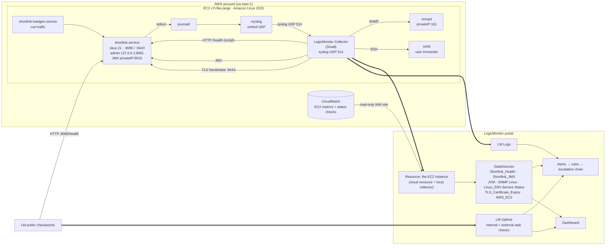
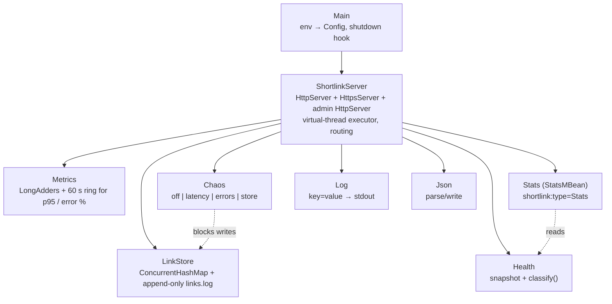

# Shortlink: User & Developer Guide

This guide covers how Shortlink and its monitoring fit together, from the code
up to the LogicMonitor portal. It explains how to build, deploy and operate
the service, and how to monitor it.

The [README](../README.md) is the design record. It explains *why* the health
model, datapoint types and thresholds are what they are. This guide covers
*how* and *what to type*.

---

## Contents

1. [Quick start](#1-quick-start)
2. [Architecture](#2-architecture)
3. [The service](#3-the-service)
4. [AWS: instance, network, deployment](#4-aws-instance-network-deployment)
5. [LogicMonitor: layer by layer](#5-logicmonitor-layer-by-layer)
6. [Alerting: thresholds, timing, routing, dependencies](#6-alerting-thresholds-timing-routing-dependencies)
7. [Operations](#7-operations)
8. [Troubleshooting](#8-troubleshooting)
9. [Ubuntu instead of Amazon Linux](#9-ubuntu-instead-of-amazon-linux)
10. [What was verified, and how](#10-what-was-verified-and-how)
11. [Sources](#11-sources)

---

## 1. Quick start

### Prerequisites

| Tool | Why | Verified with |
|---|---|---|
| JDK 21+ (`javac`, `jar`, `keytool`) | Build, run, tests (tests generate a keystore) | OpenJDK 25 locally; Corretto 21.0.12 on Amazon Linux 2023 |
| Groovy (optional) | Collection-script tests, running the script by hand | Groovy 6.0 (JDK 25); Groovy 2.4.16 (JDK 8) |
| `curl`, `jq` | Poking the API | — |
| podman (optional) | Rehearsing the cloud-init script in `amazonlinux:2023` | podman 5 |

### Five commands

```bash
cd shortlink

# 1. Build and run every test (offline, ~10 s)
./run-tests.sh

# 2. Run it locally with chaos enabled
SHORTLINK_ADMIN_TOKEN=dev SHORTLINK_DATA_DIR=/tmp/shortlink java -jar build/shortlink.jar

# 3. In another shell: create, follow, inspect
curl -s -XPOST localhost:8080/api/links -d '{"url":"https://www.logicmonitor.com/"}' | jq
curl -si localhost:8080/<code> | head -3
curl -s localhost:8080/health | jq

# 4. What the LogicMonitor collector will see
groovy scripts/collection.groovy 127.0.0.1:8080

# 5. Break it, watch the script report it, fix it
curl -s -XPOST -H 'X-Admin-Token: dev' 'localhost:8081/admin/chaos?mode=store'
groovy scripts/collection.groovy 127.0.0.1:8080      # httpStatus=503 status=2 storeOk=0
curl -s -XPOST -H 'X-Admin-Token: dev' 'localhost:8081/admin/chaos?mode=off'
```

To generate traffic locally, run `TARGET=http://127.0.0.1:8080 deploy/loadgen.sh`.

---

## 2. Architecture

### 2.1 Runtime: one VM, four signal paths into LogicMonitor



Key points:

- **One resource, many sources.** The EC2 instance appears once in
  LogicMonitor, discovered by the AWS integration. Turning on *monitoring via
  local collector* for that resource adds the collector-based DataSources
  (SNMP, JMX, script) to the same resource, so there's no duplicate. LM
  documents that this "does not result in double billing".
- **Collector traffic never crosses the security group.** The collector talks
  to the VM's own private IP. Linux delivers that locally, so 161, 9010, 22
  and 514 stay closed to the outside world.
- **Two signals don't depend on the VM.** CloudWatch is read by
  LogicMonitor's cloud collectors through the IAM role, and the external web
  check runs from LogicMonitor's public checkpoints. Both keep working when
  the VM, and the collector on it, are down. See [§6.4](#64-root-cause-and-the-collector-on-the-same-vm).

### 2.2 Layer coverage

| Layer | What answers "is it healthy?" | LogicMonitor feature | Collected by |
|---|---|---|---|
| **VM** (infrastructure) | Running state, EC2 status checks, CPU, network, EBS | AWS cloud monitoring (`AWS_EC2` and related) | LM cloud collectors via CloudWatch |
| **OS** | CPU, memory, filesystems, interfaces, uptime | SNMP Linux modules (LM's primary method); Linux_SSH as a complement | Local collector |
| **OS → service** | Is `shortlink.service` active? | Linux_SSH **Service Status** (`systemctl`) | Local collector |
| **Runtime** (JVM) | Heap, GC, threads | LM's built-in JVM/JMX modules via `jmx.port` | Local collector |
| **Application** (inside view) | UP/DEGRADED/DOWN, p95, error rate, store, rates | `Shortlink_Health` (script); `Shortlink_JMX` (graph-only) | Local collector |
| **Application** (user's view) | Does `/health` answer 200 from inside the VPC, and from the internet? | LM Uptime internal web check + external web check | Collector; public checkpoints |
| **Security hygiene** | Certificate days left and trust on :8443 | `TLS_Certificate_Expiry-` (sibling module) | Local collector |
| **Events** | Access and app logs, health transitions, chaos, sshd/auth | LM Logs via syslog LogSource | Local collector (UDP 514) |
| **Traces** (optional) | Per-request spans | LM APM via the OpenTelemetry Java agent | Direct OTLP to the portal |

### 2.3 Code architecture



`/health` and the MBean read the same `Health` snapshot. So the script
DataSource, the JMX DataSource and a person running `curl` all see the same
numbers.

---

## 3. The service

### 3.1 HTTP API

| Method & path | Success | Errors |
|---|---|---|
| `POST /api/links` body `{"url":"https://..."}` | `201` JSON `{code, shortUrl, url, createdAt, hits}` + `Location` | `400` invalid JSON / missing or bad url, `413` body > 8 KB, `503` store unavailable |
| `GET /{code}` | `302` with `Location`, counts a hit | `404` |
| `GET /api/links/{code}` | `200` JSON stats | `404` |
| `GET /health` | `200` (UP/DEGRADED) or `503` (DOWN), JSON | — |
| `GET /` | `200` service info | — |
| anything else | — | `404`, or `405` with `Allow` |

URL rules: `http` or `https` only; a host is required; at most 2048
characters; no whitespace or control characters. `javascript:`, `ftp:` and
bare `example.com` are all rejected with a reason.

Codes are 7 random base62 characters, from `SecureRandom`.

### 3.2 Configuration (environment)

All configuration is in `/etc/shortlink/shortlink.env`. Each variable is
documented in [`deploy/shortlink.env.example`](../deploy/shortlink.env.example).

| Variable | Default | Notes |
|---|---|---|
| `SHORTLINK_BIND` / `SHORTLINK_PORT` | `0.0.0.0` / `8080` | Public listener |
| `SHORTLINK_TLS_KEYSTORE` / `_PASSWORD` / `_PORT` | unset / — / `8443` | HTTPS twin, enabled when a keystore is set |
| `SHORTLINK_ADMIN_BIND` / `_PORT` / `_TOKEN` | `127.0.0.1` / `8081` / unset | No token means no admin listener |
| `SHORTLINK_DATA_DIR` | `data` | systemd sets `/var/lib/shortlink` |
| `SHORTLINK_BASE_URL` | from `Host` header | cloud-init sets the public DNS name |
| `SHORTLINK_DEGRADED_P95_MS` / `_ERROR_PERCENT` / `SHORTLINK_WINDOW_SECONDS` | `500` / `5` / `60` | Health rules |
| `SHORTLINK_CHAOS_LATENCY_MS` / `_ERROR_PERCENT` | `1500` / `50` | Chaos strength |

### 3.3 Logs

There is one line per event on stdout. systemd tags each line `shortlink`,
and it flows to journald, then rsyslog, then the collector, then LM Logs.

```
ts=2026-10-09T15:02:11.204Z level=INFO event=access method=GET path=/aB3xK9q status=302 ms=1.3 client=127.0.0.1 tls=false
ts=2026-10-09T15:02:40.118Z level=WARN event=chaos_mode_changed from=off to=latency
ts=2026-10-09T15:03:01.552Z level=WARN event=health_changed from=UP to=DEGRADED p95LatencyMs=1502.4 errorRatePct=0.0 storeOk=true chaosMode=latency
ts=2026-10-09T15:05:12.009Z level=ERROR event=store_write_failed error="simulated store failure (chaos mode store)"
```

| Event | Level | When |
|---|---|---|
| `started` / `stopped` | INFO | Lifecycle. `started` includes port, links loaded and Java version |
| `access` | INFO | Every public request except `/health` |
| `link_created` | INFO | New link |
| `health_changed` | WARN | Status transition, with the numbers that caused it |
| `chaos_mode_changed`, `admin_unauthorized` | WARN | Fault injection and failed admin attempts |
| `store_hit_not_persisted`, `store_records_skipped` | WARN | Store degraded or recovered from a torn write |
| `store_write_failed`, `request_failed`, `startup_failed` | ERROR | Something broke |

Because the fields are `key=value`, LM Logs queries can filter on them
directly, for example `level=ERROR`, `event=health_changed`, or
`status=500`. `/health` polls are not logged, so the collector's polling
doesn't flood the log.

### 3.4 JMX

The MBean is `shortlink:type=Stats`. Every attribute LogicMonitor should graph
is numeric:

| Attribute | Type | Meaning |
|---|---|---|
| `StatusCode` | int | 0 UP, 1 DEGRADED, 2 DOWN |
| `UptimeSeconds`, `RequestsTotal`, `ErrorsTotal`, `ClientErrorsTotal` | long | |
| `Links` | int | |
| `P95LatencyMs`, `ErrorRatePct` | double | Same 60 s window as `/health` |
| `StoreOk` | int | 1 / 0. An int, not a boolean, so the collector reads a number |
| `ChaosModeCode` | int | 0 off, 1 latency, 2 errors, 3 store |
| `Status`, `ChaosMode` | String | For people using jconsole |

These are the JVM flags, as set by cloud-init in `JMX_OPTS`:

```
-Dcom.sun.management.jmxremote.port=9010
-Dcom.sun.management.jmxremote.rmi.port=9010      # same port: one port to reason about
-Dcom.sun.management.jmxremote.host=<private-ip>  # bind only there, not 0.0.0.0
-Djava.rmi.server.hostname=<private-ip>           # the address RMI hands back to clients
-Dcom.sun.management.jmxremote.authenticate=false
-Dcom.sun.management.jmxremote.ssl=false
```

Why the private IP and not `127.0.0.1`? The collector connects to
`##HOSTNAME##`, the resource's hostname, which for the EC2 resource is its
private address. If JMX were bound to loopback only, the collector couldn't
reach it. Binding to the private IP, with 9010 closed in the security group,
keeps JMX local to the VM in practice. LogicMonitor's Java page also says to
set `java.rmi.server.hostname` and recommends using the same port for RMI.
`ProcessTest` launches the real jar with exactly these flags, on loopback,
and reads both `shortlink:type=Stats` and `java.lang:type=Memory` over remote
JMX.

### 3.5 Fault injection

```bash
sudo chaos latency    # or: errors | store | off;  no argument shows the current mode
```

`/usr/local/bin/chaos` reads the token from the env file and calls the admin
listener on loopback. It needs `sudo` because the env file is mode 0640,
owned by `root:shortlink`.

---

## 4. AWS: instance, network, deployment

### 4.1 Account and credits (verified 2026-10-06)

Accounts created on or after 15 July 2025 work like this:

- **Credits.** You get USD 100 in credits at sign-up, and up to another USD
  100 for completing activities. Launching and terminating an EC2 instance is
  one of them, worth USD 20.
- **Free plan.** It "ensures you won't incur any charges". It ends after six
  months or when the credits are used up. The account then closes
  automatically, though you can upgrade within 90 days.
- **Paid plan.** Credits are used first, then normal pay-as-you-go pricing
  applies.

Source:
[docs.aws.amazon.com/.../free-tier-plans.html](https://docs.aws.amazon.com/awsaccountbilling/latest/aboutv2/free-tier-plans.html).

The free-tier-eligible EC2 types for these accounts are `t3.micro`,
`t3.small`, `t4g.micro`, `t4g.small`, `c7i-flex.large` and `m7i-flex.large`
([EC2 free tier usage](https://docs.aws.amazon.com/AWSEC2/latest/UserGuide/ec2-free-tier-usage.html)).

### 4.2 Instance type: **c7i-flex.large** (2 vCPU, 4 GiB)

| Type | vCPU / RAM | us-east-1 Linux $/h | ≈ $/week | Fits app + collector? |
|---|---|---|---|---|
| t3.micro / t4g.micro | 2 / 1 GiB | 0.0104 / 0.0084 | 1.75 / 1.41 | No |
| t3.small / t4g.small | 2 / 2 GiB | 0.0208 / 0.0168 | 3.49 / 2.82 | No: a Small collector alone is about 2 GB |
| **c7i-flex.large** | **2 / 4 GiB** | **0.08479** | **14.24** | **Yes, with about 1 GB of headroom** |
| m7i-flex.large | 2 / 8 GiB | 0.09576 | 16.09 | Yes, with plenty to spare |

Prices are from AWS's EC2 price list for us-east-1. Specs are from the EC2
instance-type pages.

The case for c7i-flex.large:

- **The collector sets the size.** LogicMonitor's Small collector "consumes
  approximately 2GB system memory", with the Linux profile given as "1 vCPU;
  2 GiB RAM, 1 GiB JVM maximum memory". Nano uses less than 1 GB but is
  "intended for testing purposes and not recommended for production"
  ([adding-collector](https://www.logicmonitor.com/support/adding-collector),
  [collector-capacity](https://www.logicmonitor.com/support/collector-capacity)).
- **The app is small.** Shortlink uses a 256 MB heap, roughly 0.4–0.5 GB RSS
  (my estimate). The OS, sshd, rsyslog and snmpd add a few hundred MB. That
  puts the total at about 3 GB. A 2 GiB instance can't hold it; 4 GiB can,
  and cloud-init adds 1 GB of swap as a margin.
- **It is the type LogicMonitor recommends.** LM advises "Avoid burstable,
  shared-core, or CPU-credit-based instances" and recommends "AWS C- and
  M-series". t3 and t4g are burstable; c7i-flex is C-series.
- **The cost is small.** For one week: about $14.24 compute, plus about $0.84
  for the public IPv4 address ($0.005/h), plus about $0.56 for 30 GB of gp3.
  That is roughly **$16 of the $100–$200 in credits**.

Choose **x86_64** Amazon Linux 2023. c7i-flex is Intel. Pick
**m7i-flex.large** instead if you also run the OpenTelemetry collector on the
box, or want a Medium collector.

Stop the instance between sessions if you like; credits are only used while
it runs. The public IP and DNS name change on every stop and start, though,
so allocate an **Elastic IP** if you stop it before the demo. That matters
because the certificate SANs, the external web check URL and
`SHORTLINK_BASE_URL` all contain the address. After you associate the
Elastic IP, run `sudo shortlink-cert`. It regenerates the certificate and the
base URL from the new address, then restarts the service. An Elastic IP attached to a
running instance costs the same $0.005/h as any public IPv4 address.

### 4.3 Security group `shortlink-demo`

| Port | Source | Why |
|---|---|---|
| 22/tcp | **My IP /32** only | SSH, plus `push.sh` |
| 8080/tcp | 0.0.0.0/0 | The external web check from LM checkpoints, and people clicking a short link. The admin endpoints are not on this port |
| 8443/tcp | My IP /32 (or 0.0.0.0/0 for the demo) | HTTPS twin. The collector reaches it internally either way |
| 161, 514, 8081, 9010 | **not opened** | SNMP, syslog, admin and JMX are reached only from the VM itself |

Outbound: leave the default (all). The collector needs HTTPS (443) out to
`<portal>.logicmonitor.com`.

If you'd rather not open 8080 to the world, restrict it to LogicMonitor's
checkpoint IP ranges. That list wasn't checked here, so look it up in the
portal or support site. The other option is to rely on the internal web check
alone.

### 4.4 Launch

1. `deploy/make-user-data.sh` writes `build/user-data.sh`. It is about 13 KB;
   EC2's limit is 16 KB.
2. In the EC2 console, choose **Launch instance**:
   - Name `shortlink-demo`. Add the tag `Application=shortlink`, which is
     useful for dynamic groups.
   - AMI: Amazon Linux 2023 (x86_64). Type: `c7i-flex.large`.
   - Key pair: create `shortlink-demo` (RSA, .pem).
   - Network: default VPC, public subnet, auto-assign public IP. Security
     group `shortlink-demo` ([§4.3](#43-security-group-shortlink-demo)).
   - Storage: 30 GiB gp3. 8 GiB is too tight once the collector is installed.
   - Advanced → **Metadata version: V2 only**. **User data**: paste
     `build/user-data.sh`.
3. Wait for the status checks to show 2/2. Then:

   ```bash
   chmod 600 ~/.ssh/shortlink-demo.pem
   deploy/push.sh ec2-user@<public-dns> ~/.ssh/shortlink-demo.pem
   # prints the /health JSON when the service is up
   curl -s http://<public-dns>:8080/health | jq
   ssh -i ~/.ssh/shortlink-demo.pem ec2-user@<public-dns> sudo cat /root/shortlink-lm-properties.txt
   ```

`push.sh` waits for cloud-init to finish, installs the jar and restarts the
service and the load generator. Run it again whenever you rebuild.

What cloud-init sets up (template: `deploy/cloud-init/user-data.template.sh`):

| Item | Where |
|---|---|
| Corretto 21 headless, rsyslog, net-snmp, jq, xxd (the collector installer needs it) | dnf |
| 1 GB swap | `/swapfile` |
| `shortlink` system user, `/opt/shortlink`, `/etc/shortlink` (0750) | |
| Self-signed RSA-2048 certificate, 25 days (under the 30-day warning threshold), with SANs for the public DNS name, public IP, private IP and localhost. `sudo shortlink-cert [days]` regenerates it, and `SHORTLINK_BASE_URL`, from the current addresses | `/etc/shortlink/tls.p12`, `/usr/local/sbin/shortlink-cert` |
| Env file with a generated admin token and keystore password | `/etc/shortlink/shortlink.env` |
| `shortlink.service`, `shortlink-loadgen.service` (enabled, started by push.sh) | `/etc/systemd/system/` |
| `chaos` helper | `/usr/local/bin/chaos` |
| rsyslog forwarding to `<private-ip>:514/udp` | `/etc/rsyslog.d/60-shortlink-lm.conf` |
| snmpd v2c, generated community, answers only the VM's own addresses | `/etc/snmp/snmpd.conf` |
| `lmmonitor` user with a PEM key for LM's Linux SSH modules | `/etc/lm-ssh/` |
| The LM properties to set, with the generated values | `/root/shortlink-lm-properties.txt` |

---

## 5. LogicMonitor: layer by layer

The order below is the one the runbook follows. Each step ends with what you
should see. Menu paths are written from the documentation; the portal UI may
label them slightly differently.

### 5.1 Collector

1. **Settings → Collectors → Add**, Linux, **size Small**. Download the
   installer, or copy the `curl` or `wget` command the portal gives you.
2. On the VM:
   `sudo bash LogicMonitor_Collector_*.bin -y`
   (or follow the exact command from the portal), then
   `sudo systemctl status logicmonitor-agent`.
3. Check: the collector shows as up in the portal, with a recent heartbeat.

The installer may also offer to add the collector's own host as a resource.
**Decline it**, or delete the result afterwards. The VM should be
represented by its AWS cloud resource ([§5.2](#52-aws-cloud-monitoring-the-vm-layer)).
I couldn't confirm from the docs whether LM merges a manually added device
with the cloud resource on its own.

### 5.2 AWS cloud monitoring: the VM layer

1. **Resources → Add → Cloud and SaaS → AWS**. The wizard shows LM's
   **Account ID** and an **External ID**.
2. In AWS IAM, create a role for **another AWS account**, with that account ID
   and *Require external ID* set. Attach **`ReadOnlyAccess`**, which LM
   documents as acceptable; their minimal policy is tighter if you prefer it.
   Paste the role ARN back into LM.
3. Limit the integration to **EC2** and **your region**, and choose a NetScan
   frequency. This keeps the CloudWatch API cost and the noise down.
4. Check: the `shortlink-demo` instance appears under the AWS group, with
   `AWS_EC2` datapoints. Those are CloudWatch metrics, polled every one to
   five minutes depending on how often CloudWatch publishes them.
5. Open that resource, then **Collector Assignments**, and turn on **Enable
   Monitoring via local Collector**. Choose the collector from §5.1. From now
   on, collector-based DataSources apply to this same resource.

### 5.3 Properties on the EC2 resource

Copy these from `/root/shortlink-lm-properties.txt`:

```
shortlink.port      = 8080                         → Shortlink_Health, Shortlink_JMX
jmx.port            = 9010                         → JVM modules, Shortlink_JMX
snmp.version        = v2c
snmp.community      = <generated>                  → SNMP Linux modules
ssh.user            = lmmonitor
ssh.cert            = /etc/lm-ssh/lmmonitor_id_rsa → Linux_SSH modules
linux.ssh.services  = shortlink.service            → Service Status discovery
tls.endpoints       = <public-dns>:8443            → TLS_Certificate_Expiry-
```

`ssh.cert` is a path on the collector host. That works here because the
collector runs on this VM and as root, which is the default. If you
installed the collector as a non-root user, copy the key somewhere that user
can read it.

### 5.4 OS layer

**SNMP (primary).** LogicMonitor's Linux SSH page says the SSH package "is
designed only for the systems where SNMP is not configured. If SNMP is
configured, more robust out-of-the-box monitoring will activate". So SNMP is
the main OS path here. Once `snmp.*` is set, wait for or force
(**Resources → ⋯ → Run Active Discovery**) discovery of CPU, memory,
filesystems and interfaces. To check from the VM:

```bash
snmpget -v2c -c <community> <private-ip> SNMPv2-MIB::sysDescr.0
```

**Linux SSH (complement): Service Status.** This is the one thing SNMP
doesn't give you: whether `shortlink.service` is active according to
systemd. The Linux SSH package includes a *Service Status* DataSource that
calls `systemctl`. Either use its discovery script with `linux.ssh.services`,
or add the instance by hand with **Add Monitored Instance**. The `lmmonitor`
user is unprivileged, as LM recommends, and its key is classic PEM format
(`ssh-keygen -m PEM`), as LM requires.

The `addCategory_Linux_SSH` PropertySource excludes AWS and Azure hosts. On
this EC2 resource you may have to add `Linux_SSH` to `system.categories` by
hand before the Linux SSH modules apply. That is my inference from the
documentation and needs checking in the portal.

### 5.5 Runtime layer: JVM via JMX

- **Built-in JVM modules.** With `jmx.port=9010` set, LogicMonitor's JMX
  modules discover the JVM (heap, GC, threads, class loading) through
  `service:jmx:rmi:///jndi/rmi://##HOSTNAME##:##jmx.port##/jmxrmi`. I couldn't
  verify the exact module names from the docs; look for the JVM or Java
  modules that apply once the property is set.
- **`Shortlink_JMX` (optional, graph-only).** This is a JMX DataSource built
  from [`module/Shortlink_JMX.json`](../module/Shortlink_JMX.json). Each
  datapoint needs the MBean object name `shortlink:type=Stats` and the
  attribute, for example `RequestsTotal`, entered in **separate fields**, as
  LM's JMX collection docs describe. Use the same types as the script
  DataSource: derive with a minimum of 0 for the `*Total` counters, gauge for
  everything else. It has no thresholds, so it adds no duplicate alerts. Its
  purpose is to show the inside view (JMX) next to the outside view (HTTP).

### 5.6 Application layer: `Shortlink_Health`

`module/Shortlink_Health.json` is this repo's spec of the module, in the same
layout as `lm-tls-cert-expiry`. It is not an LM export. To build it:

1. **Modules → Add → DataSource.** Name `Shortlink_Health`, display name
   `Shortlink Health`, group `Shortlink`. Collect every **1 minute**. Turn
   **Multi-instance off**.
2. AppliesTo: `shortlink.port =~ "^[0-9]+$"`
3. Collector: **Script → Embedded Groovy**. Paste
   [`scripts/collection.groovy`](../scripts/collection.groovy) **unchanged**.
4. Datapoints: add one per entry in the JSON, each as a normal datapoint with
   *Key-Value pairs* (multi-line key-value) and the given key.
   - **gauge** except `requestRate`, `serverErrorRate` and `clientErrorRate`.
   - Those three are **derive**, with **valid value range min 0**.
   - Thresholds: `reachable != 1` critical, `storeOk != 1` critical,
     `p95LatencyMs > 500 1000`, `errorRatePct > 5 20`,
     `responseTimeMs > 2000` warning.
   - Copy the per-datapoint alert subjects and bodies.
5. Save. **Test Script** against the EC2 resource should print the same lines
   as `groovy scripts/collection.groovy <private-ip>:8080` run on the VM.
6. Check: within two polls, the graphs show `requestRate` around 1–3/s from
   the load generator, `clientErrorRate` slightly above zero, `status=0` and
   `chaosMode=0`.

`shortlink.host` is optional. It overrides `system.hostname` as the target
when they differ.

### 5.7 Certificate layer: `TLS_Certificate_Expiry-`

Build or import the sibling module (see
[its guide](../../lm-tls-cert-expiry/docs/DOCUMENTATION.md#6-deploying-to-a-logicmonitor-portal)).
With `tls.endpoints = <public-dns>:8443`, you should see `handshakeOk=1`,
`daysUntilExpiry≈89` and **`chainTrusted=0`**, which raises an **error** alert.
That alert is honest and easy to explain: the certificate is self-signed. In
production you would use an ACME or ACM-issued certificate, or import a
private CA into the collector's trust store. For the demo, either acknowledge
the alert or set an instance-level threshold override with a note.

To show an expiry warning as well, set `TLS_VALIDITY_DAYS=25` in the
user-data before launch, which puts `daysUntilExpiry` below 30.

### 5.8 Synthetic checks: LM Uptime

| Check | Target | Settings | Shows |
|---|---|---|---|
| **Internal web check** (from the collector) | `http://<private-ip>:8080/health` | 1 min; expect status 200 | Reachability inside the VPC, independent of the script |
| **External web check** (LM checkpoints) | `http://<public-dns>:8080/health` | 1 min; all checkpoints; expect 200; alert after 2 consecutive failures | What a user on the internet sees. Survives the VM and collector being down |

LM documents five public checkpoints, intervals from 1 to 10 minutes, and
alerting after *N* consecutive failed checks. The effective transition time
is the polling interval × the number of failed checks. LM also says not to
edit the LM Uptime DataSources' own thresholds. Set the check up so that
**DOWN (503) fails it and DEGRADED (200) passes it**. That's how the app's
health contract is meant to be read: slow, but still serving.

### 5.9 LM Logs

1. **Collector side.** LogicMonitor recommends a **syslog LogSource**: "Every
   LM Collector includes a pre-configured default LogSource for syslog
   ingestion". The legacy `lmlogs.syslog.enabled` agent.conf switch is
   documented only for collector versions 35.200 and earlier. The collector
   listens on **UDP 514**, which is the documented default
   (`eventcollector.syslog.port`).
2. **Resource mapping.** rsyslog sends RFC 5424 messages whose HOSTNAME field
   is the VM's name, `ip-172-31-…`, which VPC DNS resolves to the private IP.
   In the LogSource, map by **IP** (resolve the host field). If logs arrive
   unmapped, use the *Static* or *LM Property* method against the resource
   instead.
3. **Check.** Run `logger -t shortlink "test from $(hostname)"` on the VM. It
   should appear in **Logs** on the EC2 resource within about a minute. Then
   try the queries `event=health_changed` and `level=ERROR`.

What gets forwarded: everything tagged `shortlink`, all `authpriv` messages
(sshd and sudo), and warning or worse from the rest of the OS. Those last two
give LM Logs anomaly detection something real to learn from.

### 5.10 Dashboard: "Shortlink: service health"

| Row | Widgets |
|---|---|
| 1 (status) | **Big Number** `Shortlink_Health.status` (0/1/2 with a legend) · **Website Status** external check · **Alert List** filtered to the resource |
| 2 (golden signals) | **Custom Graph** `requestRate`, `serverErrorRate`, `clientErrorRate` · **Custom Graph** `p95LatencyMs` with 500/1000 reference lines · **Custom Graph** `errorRatePct` |
| 3 (runtime and OS) | JVM heap used versus max · GC time · CPU and memory (SNMP) · filesystem `/` % used |
| 4 (VM) | `AWS_EC2` CPUUtilization, StatusCheckFailed, NetworkIn/Out |
| 5 (context) | `chaosMode` and `uptimeSeconds` (restarts show as a sawtooth) · Logs widget filtered to `event=health_changed`, if your portal has one |

### 5.11 Optional: traces into LM APM (OpenTelemetry)

This is not needed for the brief. Do it only if Thursday goes well.
LogicMonitor documents sending OTLP **directly** to the portal, without
running an OpenTelemetry collector:

```bash
# On the VM (one-time):
sudo curl -sL -o /opt/shortlink/opentelemetry-javaagent.jar \
  https://github.com/open-telemetry/opentelemetry-java-instrumentation/releases/latest/download/opentelemetry-javaagent.jar
# Add to JAVA_OPTS in /etc/shortlink/shortlink.env, then: sudo systemctl restart shortlink
-javaagent:/opt/shortlink/opentelemetry-javaagent.jar
-Dotel.service.name=shortlink
-Dotel.resource.attributes=service.namespace=shortlink-demo,host.name=<private-ip>
-Dotel.exporter.otlp.endpoint=https://<portal>.logicmonitor.com/rest/api
-Dotel.exporter.otlp.protocol=http/protobuf
-Dotel.exporter.otlp.headers=Authorization=Bearer <API bearer token with data-ingestion rights>
-Dotel.metrics.exporter=none -Dotel.logs.exporter=none
```

These settings come from LM's *trace data forwarding without an OpenTelemetry
collector* page. The endpoint, protocol, bearer header and
`service.namespace` are all from there.

**Unverified:** whether the agent automatically creates spans for the JDK's
built-in `com.sun.net.httpserver` server. If **Traces** shows nothing after a
few minutes of load, call the step out of scope rather than debug it live.
The agent adds roughly 100 MB of RSS, which still fits on c7i-flex.large.

---

## 6. Alerting: thresholds, timing, routing, dependencies

### 6.1 Thresholds

| Source | Datapoint / check | Warning | Error | Critical |
|---|---|---|---|---|
| Shortlink_Health | `reachable` | | | `!= 1` |
| Shortlink_Health | `storeOk` | | | `!= 1` |
| Shortlink_Health | `p95LatencyMs` | `> 500` | `> 1000` | |
| Shortlink_Health | `errorRatePct` | `> 5` | `> 20` | |
| Shortlink_Health | `responseTimeMs` | `> 2000` | | |
| TLS_Certificate_Expiry- | `daysUntilExpiry` / `chainTrusted` | `< 30` | `< 14` / `!= 1` | `< 7` |
| LM Uptime | external and internal web checks | | | after 2 consecutive failures |
| SNMP / AWS / JVM | LM defaults | Keep them. Tune only if they're noisy during the build | | |

### 6.2 Expected timing (60 s collection, trigger and clear "immediately")

LM's defaults are "Trigger alert immediately" and "Clear alert immediately",
both set per datapoint. A breach is therefore alerted on the first poll that
sees it. A trigger interval of *N* adds *N* polls.

| Action | Signal | Alert expected | Clears after the fix |
|---|---|---|---|
| `sudo chaos latency` | p95 rises within seconds, as load-generator requests take 1.5 s | `p95LatencyMs` **error** on the next poll: **≤ 60 s**, typically 30–60 s | `chaos off`, then the 60 s window has to roll off, then the next poll: **60–120 s** |
| `sudo chaos errors` | 50 % 5xx | `errorRatePct` **error**: ≤ 60 s | 60–120 s |
| `sudo chaos store` | `/health` returns 503 | `storeOk` **critical**: ≤ 60 s. The external check fails after 2 checks: ~2–3 min | Next poll: ≤ 60 s |
| `sudo systemctl stop shortlink` | Port closed | `reachable` **critical**: ≤ 60 s. Service Status follows on its own interval. Web checks: ~2–3 min. JMX goes to No Data, which doesn't alert | `systemctl start`: next poll, ≤ 60 s |
| Stop the EC2 instance | Everything on the VM stops, collector included | See [§6.4](#64-root-cause-and-the-collector-on-the-same-vm) | — |

Delivery through the escalation chain (email etc.) adds seconds to a
minute.

For production, set the trigger interval to **2 polls** on `p95LatencyMs`
and `errorRatePct`. A single slow minute shouldn't page anyone. For the demo,
"immediately" keeps the story inside 15 minutes.

### 6.3 Rules and escalation chain

- **Escalation chain** `Shortlink on-call`: stage 1 is email to you (add Slack
  or Teams if an integration exists). Escalation interval: 15 minutes, so an
  unacknowledged alert is re-sent.
- **Alert rule** `Shortlink critical/error`: priority 10. Resource group
  `Shortlink Demo`, or a property match on the instance. Severity
  **error and above**. Routes to the chain.
- **Warnings** don't page. They show on the dashboard and alert list only.
- Rules are evaluated "in priority order (starting with the lowest number)",
  so make sure no broader rule with a lower number catches these first.

### 6.4 Root cause, and the collector on the same VM

**Dependent Alert Mapping (DAM)** is LogicMonitor's root-cause feature. When
a resource becomes unreachable, which LM detects through `PingLossPercent` or
`idleInterval`, alerts on resources that depend on it are marked *dependent*
and not routed. They are delayed, then suppressed. DAM needs **LogicMonitor
Enterprise** and topology. The **collector host is the entry point**, and DAM
works per resource, not per instance. Check whether your portal has it
(**Settings → Alert Settings**, or the DAM toggle on an alert rule or group).

This deployment has one property that matters more than any setting: **the
collector runs on the VM it monitors.** When the VM goes down:

- The collector goes with it. **No collector-based DataSource reports
  anything**, so `Shortlink_Health`, SNMP and JMX raise no alerts at all.
  Application alerts are "suppressed" naturally, but the danger is the
  opposite one: silence.
- What still fires: the **collector-down** alert; the **AWS_EC2** status-check
  and state datapoints, read via CloudWatch by LM's cloud collectors; and the
  **external web check** from public checkpoints. Those are the VM-down
  signals, and none of them depend on the VM.
- **HostStatus** is about reachability as seen by a collector. LM suppresses
  notifications once a host has been unreachable for six minutes and then
  raises the HostStatus critical. A newly added device needs at least 30
  minutes of inaccessibility. Script DataSources don't affect
  `idleInterval`. So HostStatus is not a demo-able signal here.

In production, put the collector on a separate small host, or better, two
collectors in a collector group with failover. Then a VM failure produces
`HostStatus` on the VM, DAM marks the `Shortlink_Health` and JVM alerts on it
as dependent, and only the root-cause alert pages. It's a cost and trade-off
decision for a single-VM demo, not an oversight.

If DAM isn't available, use the manual approach. An alert rule with a higher
priority routes `AWS_EC2` state and status-check alerts to the chain, and
during planned work an **SDT** (scheduled downtime) on the resource silences
everything under it.

---

## 7. Operations

### 7.1 Everyday commands (on the VM)

```bash
systemctl status shortlink shortlink-loadgen
journalctl -u shortlink -f                          # live key=value log
journalctl -u shortlink --since -10min | grep -E 'level=(WARN|ERROR)'
curl -s localhost:8080/health | jq
sudo chaos                                          # current chaos mode
sudo systemctl restart shortlink                    # counters reset; links persist
ls -lh /var/lib/shortlink/links.log
```

### 7.2 Restart behaviour

- `Restart=on-failure`. A crash or `kill -9` comes back in 5 s. `systemctl
  stop` stays stopped, which is why it's the clean "break" for the demo.
- The JVM exits **143** after its shutdown hook on SIGTERM. The unit has
  `SuccessExitStatus=143` so that this counts as a clean stop rather than a
  failure. `ProcessTest` checks the exit code.
- `ConditionPathExists=/opt/shortlink/shortlink.jar` means the unit does
  nothing until `push.sh` has delivered the jar, so it doesn't loop in
  restarts at first boot.
- On start, the store replays `links.log`. A torn last line, from a crash in
  the middle of a write, is skipped and counted (`store_records_skipped`).

### 7.3 Memory budget (c7i-flex.large, 4 GiB)

| Process | Approx. |
|---|---|
| LogicMonitor collector (Small) | ~2 GB (LM's figure) |
| Shortlink JVM (`-Xmx256m`) | ~0.4–0.5 GB |
| OS, sshd, rsyslog, snmpd, journald | ~0.3–0.5 GB |
| Headroom + 1 GB swap | ~0.8 GB + swap |

`-XX:+ExitOnOutOfMemoryError` makes a heap OOM exit the JVM so that systemd
restarts it, rather than leaving it limping.

### 7.4 Hardening JMX

For anything beyond the demo, turn on JMX authentication:

```bash
sudo tee /etc/shortlink/jmxremote.password <<< 'lmmonitor <strong-password>'
sudo tee /etc/shortlink/jmxremote.access   <<< 'lmmonitor readonly'
sudo chown shortlink:shortlink /etc/shortlink/jmxremote.* && sudo chmod 0400 /etc/shortlink/jmxremote.*
# In JMX_OPTS: authenticate=true plus
#   -Dcom.sun.management.jmxremote.password.file=/etc/shortlink/jmxremote.password
#   -Dcom.sun.management.jmxremote.access.file=/etc/shortlink/jmxremote.access
```

Then set `jmx.user` and `jmx.pass` on the resource. For JMX across hosts, also
enable TLS (`jmxremote.ssl=true`).

### 7.5 Cost control and teardown

- In **AWS Budgets**, set a $20 monthly budget with an email at 50 %. Doing
  this also earns one of the $20 credit activities.
- When you're done, terminate the instance, release any Elastic IP, delete
  the IAM role, and remove the AWS integration from LogicMonitor.

---

## 8. Troubleshooting

| Symptom | Cause | Fix |
|---|---|---|
| `push.sh` hangs at `cloud-init status --wait` | First boot is still installing | Wait, or check `sudo tail -f /var/log/cloud-init-output.log` |
| `systemctl status shortlink` says *condition failed* | The jar isn't there yet | Run `deploy/push.sh` |
| `startup_failed ... Address already in use` | Another process has 8080, 8081 or 8443 (the collector doesn't use these) | `sudo ss -lntp \| grep -E ':(8080\|8081\|8443\|9010)'` |
| `Shortlink_Health` shows `reachable=0` but curl on the VM works | The resource's `system.hostname` isn't an address the app listens on | Set `shortlink.host` to the private IP |
| The DataSource doesn't apply | `shortlink.port` is missing or not numeric, or local collector monitoring is off for the cloud resource | Check the property; [§5.2](#52-aws-cloud-monitoring-the-vm-layer) step 5 |
| JVM / JMX modules show No Data | JMX bound to a different IP than the collector uses, or a wrong `jmx.port` | `sudo ss -lntp \| grep 9010`; make the `JMX_OPTS` IPs match the resource's hostname |
| SNMP modules don't appear | Community or version mismatch, or snmpd not listening on the private IP | Use the `snmpget` from [§5.4](#54-os-layer); `sudo ss -lunp \| grep 161` |
| Linux_SSH modules don't apply | Category not set on an AWS host | Add `Linux_SSH` to `system.categories` ([§5.4](#54-os-layer)) |
| No logs in LM Logs | Collector syslog LogSource not active, or a mapping mismatch | `sudo ss -lunp \| grep 514` (the collector should own it); `logger -t shortlink hi`; check the LogSource mapping; `sudo tcpdump -ni any udp port 514` |
| `p95LatencyMs` alert won't clear after `chaos off` | The 60 s window still holds slow samples | Wait up to two minutes; this is expected ([§6.2](#62-expected-timing-60-s-collection-trigger-and-clear-immediately)) |
| Graph spikes or dips at a restart | A rate type other than derive with min 0 | Check the datapoint type and its valid range |
| `chainTrusted=0` on `:8443` | Self-signed certificate (by design) | [§5.7](#57-certificate-layer-tls_certificate_expiry-) |
| The external web check fails, the internal one passes | Security group blocks 8080 from the internet | [§4.3](#43-security-group-shortlink-demo) |

---

## 9. Ubuntu instead of Amazon Linux

The user-data targets Amazon Linux 2023. On Ubuntu 24.04 LTS, change these:

| Step | Amazon Linux 2023 | Ubuntu 24.04 |
|---|---|---|
| Packages | `dnf install java-21-amazon-corretto-headless rsyslog net-snmp net-snmp-utils jq xxd` | `apt-get install -y openjdk-21-jre-headless snmpd snmp jq xxd` (rsyslog is preinstalled) |
| `keytool` | in the Corretto headless package | in `openjdk-21-jre-headless` |
| journald → rsyslog | rsyslog reads the journal (`imjournal`) | journald forwards to rsyslog's socket (`imuxsock`); `$programname` matching works the same |
| SNMP config | `/etc/snmp/snmpd.conf`, service `snmpd` | same path and name; the default `agentaddress` is loopback only, so the template's line is needed |
| Default SSH user | `ec2-user` | `ubuntu` (use it in `push.sh`) |
| Firewall | none by default | `ufw` inactive by default; if enabled, allow 8080/8443/22 |
| Service user shell | `/sbin/nologin` | `/usr/sbin/nologin` |
| Swap | as in the template | same |

---

## 10. What was verified, and how

**Tested locally (this repository):**

- `./run-tests.sh`: 38 JDK tests and 8 collection-script tests, all passing.
- `scripts/collection.groovy` ran under Groovy 2.4.16 / JDK 8 (podman
  `groovy:2.4-jdk8`) against a live instance and against a closed port.
- `build/user-data.sh` ran end to end in `amazonlinux:2023`, with only
  `systemctl` stubbed. Corretto 21.0.12, keystore and SANs, env file,
  `rsyslogd -N1`, snmpd answering `snmpget` with the generated community, the
  SSH key pair, `chaos`, loadgen, and the app running as `shortlink` with JMX
  bound to the container's IP and HTTPS on 8443.
- Both unit files pass `systemd-analyze verify`; the only warning is that
  paths don't exist on the build machine.

**Checked against vendor documentation on 2026-10-06:** AWS free-tier model
and eligible types, EC2 prices and specs, user-data semantics, Corretto
package name; LM collector sizes and the burstable-instance advice, SNMP-first
Linux guidance, the SSH properties and PEM requirement, JMX properties and
field syntax, local-collector monitoring of cloud resources, syslog LogSource
and UDP 514, LM Uptime intervals and transition maths, datapoint
counter/derive/valid-range behaviour, trigger and clear defaults, DAM
requirements, HostStatus timing, the Groovy 4-only collector, and direct OTLP
to the portal. URLs and quotes are in [§11 Sources](#11-sources).

**Not verified, so confirm in the portal:**

- the exact names of LM's built-in JVM modules;
- whether the collector installer's "add this host" creates a duplicate
  resource;
- whether `Linux_SSH` needs to be added to `system.categories` on an EC2
  resource;
- syslog over TCP (only UDP is documented);
- the LogSource mapping method that works first time;
- the default `idleInterval` threshold;
- LM Uptime's "N of M checkpoints" option;
- the checkpoint IP list;
- whether the OTel Java agent instruments `com.sun.net.httpserver`;
- whether free-plan credits explicitly cover public IPv4 (implied by "no
  charges");
- whether the collector needs a minimum disk size (30 GiB is plenty in
  practice, but no figure was found).

---

## 11. Sources

All of these were checked 2026-10-06. LogicMonitor support pages render
client-side, so their quotes came from the page HTML.

**AWS**
- Free tier plans: <https://docs.aws.amazon.com/awsaccountbilling/latest/aboutv2/free-tier-plans.html>.
  Quotes: "you receive USD $100 in credits after you create an account…
  earn up to an additional USD $100"; "won't incur any charges… ends after
  six months or when your credits are fully used".
- Credit activities: <https://aws.amazon.com/blogs/aws/aws-free-tier-update-new-customers-can-get-started-and-explore-aws-with-up-to-200-in-credits/>
- Eligible EC2 types: <https://docs.aws.amazon.com/AWSEC2/latest/UserGuide/ec2-free-tier-usage.html>.
  Quote: "`t3.micro`, `t3.small`, `t4g.micro`, `t4g.small`, `c7i-flex.large`, `m7i-flex.large`".
- Specs: <https://docs.aws.amazon.com/ec2/latest/instancetypes/gp.html>,
  <https://docs.aws.amazon.com/ec2/latest/instancetypes/co.html>
- Prices: the AWS Price List API EC2 us-east-1 offer file. Quote: "$0.08479
  per On Demand Linux c7i-flex.large Instance Hour".
- Public IPv4 ($0.005/h): <https://aws.amazon.com/vpc/pricing/>
- EBS free tier (30 GB): <https://aws.amazon.com/ebs/pricing/>
- User data runs as root, first boot only: <https://docs.aws.amazon.com/AWSEC2/latest/UserGuide/user-data.html>
- Corretto 21 on Amazon Linux: <https://docs.aws.amazon.com/corretto/latest/corretto-21-ug/amazon-linux-install.html>

**LogicMonitor**
- Collector sizes: <https://www.logicmonitor.com/support/adding-collector>.
  Quotes: Small "approximately 2GB"; Nano "intended for testing purposes".
- Capacity, and the advice against burstable instances: <https://www.logicmonitor.com/support/collector-capacity>
- Linux via SSH (SNMP preferred; Service Status): <https://www.logicmonitor.com/support/monitoring/os-virtualization/linux-via-ssh-monitoring>
- Credentials properties (ssh.*, jmx.*, snmp.*): <https://www.logicmonitor.com/support/getting-started/advanced-logicmonitor-setup/defining-authentication-credentials>
- Java/JMX: <https://www.logicmonitor.com/support/monitoring/applications-databases/java-applications>,
  <https://www.logicmonitor.com/support/jmx-active-discovery>,
  <https://www.logicmonitor.com/support/logicmodules/datasources/data-collection-methods/jmx-data-collection>
- AWS setup: <https://www.logicmonitor.com/support/aws-monitoring-setup>.
  Local collector on cloud resources: <https://www.logicmonitor.com/support/cloud-monitoring-using-a-collector>
- Syslog LogSource: <https://www.logicmonitor.com/support/syslog-logsource-configuration>.
  agent.conf settings: <https://www.logicmonitor.com/support/agent-conf-collector-settings>
- Web checks: <https://www.logicmonitor.com/support/adding-a-web-check>,
  <https://www.logicmonitor.com/support/internal-web-checks-using-lm-uptime>,
  <https://www.logicmonitor.com/support/alerts-for-lm-uptime>
- Datapoints (counter/derive, valid range, trigger and clear): <https://www.logicmonitor.com/support/logicmodules/datasources/datapoints/normal-datapoints-legacyui>,
  <https://www.logicmonitor.com/support/logicmodules/modules/datapoints/datapoint-overview>
- Groovy 4 only from GD-39.004: <https://www.logicmonitor.com/release-notes/gd-collector-39-004>
- Dependent Alert Mapping: <https://www.logicmonitor.com/support/dependent-alert-mapping>.
  HostStatus: <https://www.logicmonitor.com/support/logicmodules/datasources/creating-managing-datasources/host-status-host-behavior>
- Alert rules: <https://www.logicmonitor.com/support/alert-rules>.
  Escalation chains: <https://www.logicmonitor.com/support/escalation-chains>
- OTLP without a collector: <https://www.logicmonitor.com/support/trace-data-forwarding-without-an-opentelemetry-collector>
- Widgets: <https://www.logicmonitor.com/support/dashboards-and-widgets/overview/what-are-widgets>
